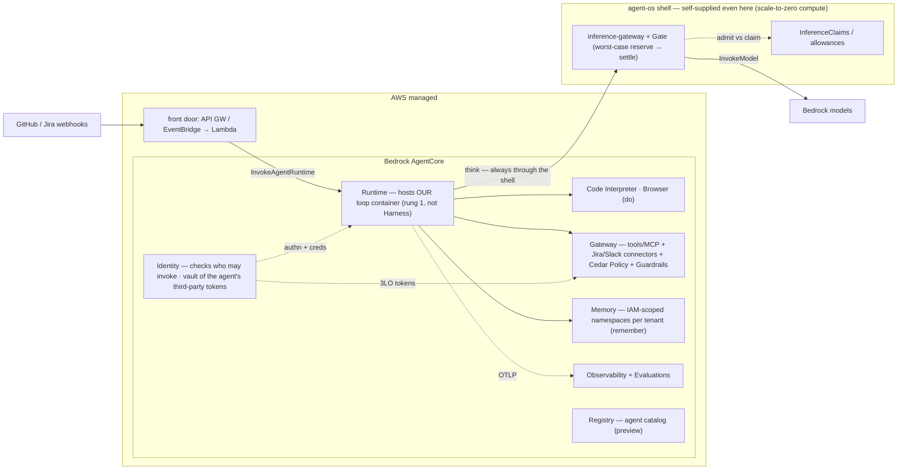
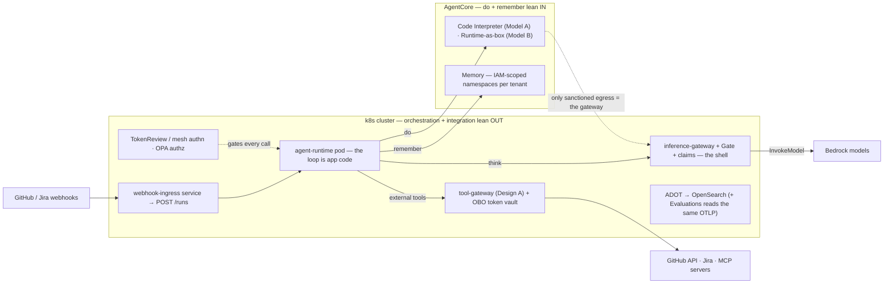
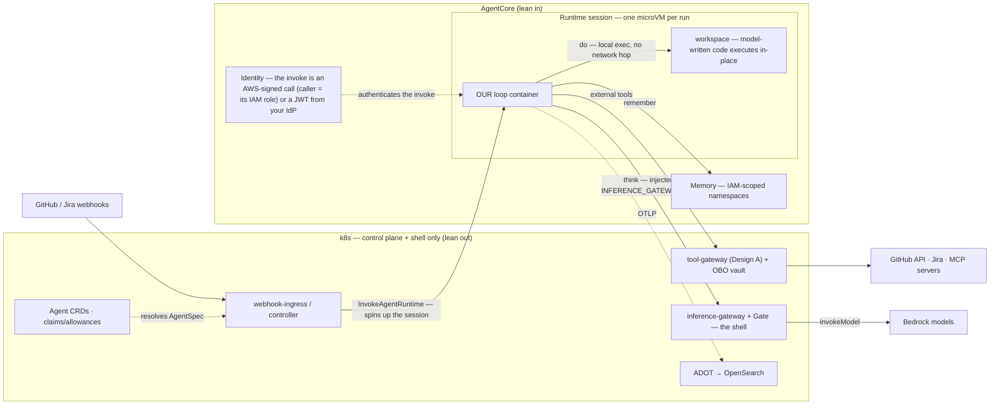
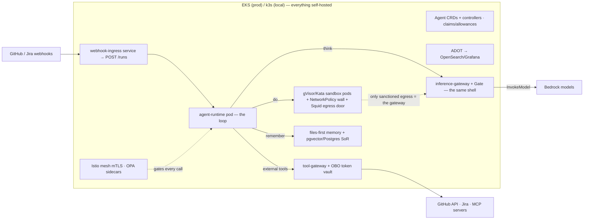

# agent-os — lean in vs lean out: the AgentCore posture map

> **What every component of the platform looks like if we lean *into* Bedrock AgentCore,
> vs lean *out* to self-hosted k8s.** A theoretical reference — companion to
> [`costs.md`](costs.md) (the money view) and [`architecture.md`](architecture.md) (the AWS
> mapping). Decisions live in [ADRs](decisions/README.md) and are cited, not re-litigated;
> this doc maps the *option space* both ways so a posture can be chosen (and re-chosen)
> per component. AgentCore facts verified 2026-07-03 against AWS docs — the service is
> moving fast (three GA launches in H1 2026 alone), so re-verify before acting on a row.

---

## TL;DR — the platform in eight jobs

The whole map, reduced to the jobs the platform does. Two versions, because the first
two jobs can be arranged two ways: **split** — the loop runs in one place and ships each
code step to a sandbox (today's default, [ADR-0006](decisions/0006-agentcore-execution-environment.md);
step-by-step governance, but a network hop per tool call) — or **co-located** — the loop
lives *inside* the sandboxed box and executes code in place (§4.3's invoke-and-go; no
hop, but governance is per-box, not per-step).

**Shape 1 — split: the loop and the code run in different places**

| What it does | Self-hosted | AgentCore |
|---|---|---|
| **Runs the agent loop** | `agent-runtime` pod on k8s | Runtime (microVM per session) |
| **Executes code** | gVisor/Kata pods + egress wall (or E2B) | Code Interpreter |
| **Calls external tools** (GitHub, Jira…) | `tool-gateway` + credential broker | Gateway + Identity token vault |
| **Remembers** | markdown files + Postgres/pgvector | Memory (per-tenant namespaces) |
| **Proves who's calling** | k8s TokenReview / mesh | IAM-signed calls / JWT check |
| **Decides what's allowed** | OPA | Policy (Cedar) |
| **Watches & scores runs** | ADOT → OpenSearch | Observability + Evaluations |
| **Calls the model & stops overspend** | Bun inference-gateway + budget gate | **nothing — always ours** |

**Shape 2 — co-located: the agent and its code share one box**

| What it does | Self-hosted | AgentCore |
|---|---|---|
| **Runs the agent + executes its code — one box** | a sandboxed pod (gVisor/Kata) with the loop or CLI inside, egress locked down | Runtime — the session microVM is both the loop's home and its workspace |
| **Calls external tools** (GitHub, Jira…) | `tool-gateway` + credential broker | Gateway + Identity token vault |
| **Remembers** | markdown files + Postgres/pgvector | Memory (per-tenant namespaces) |
| **Proves who's calling** | k8s TokenReview / mesh | IAM-signed calls / JWT check (on the invoke) |
| **Decides what's allowed** | OPA | Policy (Cedar) |
| **Watches & scores runs** | ADOT → OpenSearch | Observability + Evaluations |
| **Calls the model & stops overspend** | Bun inference-gateway + budget gate | **nothing — always ours** |

Left out of both, deliberately: **webhook triggers** (neither side has it — you build the
front door in both worlds, §3.4); **Browser / Payments / Registry** (lean-in extras with
no self-hosted counterpart); the **STS per-tenant role chain** and **Crossplane**
(identical in both columns). And the last row is the doc's thesis in one line: whichever
shape and whichever column you pick, the model call and the budget stop are yours.

---

## 1. Framing — posture is a dial per component, not a switch

Two properties of the existing design make "lean in vs lean out" a **per-component dial**
rather than a platform-wide switch:

1. **Every capability sits behind a port** ([ADR-0003](decisions/0003-ports-and-adapters.md)).
   Leaning in or out is an adapter selection in
   [`config.ts`](../packages/core/src/config.ts), not a rewrite. Most rows below already
   have both adapters written.
2. **The layers separate what leans from what can't.** L0 primitives (think/do/remember)
   are exactly what managed platforms sell — they lean freely. The L1 composition (the
   loop, the gate sequence) and L2 policy (claims, allowances) are *where governance is
   enforced* — leaning those in means the enforcement point moves inside AWS's box, which
   is a different kind of decision than swapping a backend.

Two structural facts shape the whole map ([ADR-0024](decisions/0024-build-vs-buy-managed-agent-platforms.md), re-verified July 2026):

- **Some rows have no lean-in option.** Nothing in AgentCore does pre-flight per-tenant
  inference admission (R2). The gate is unbuyable; it appears in *every* posture (§5).
- **Some rows AgentCore simply doesn't cover.** There is **no inbound webhook/event
  ingestion anywhere in AgentCore** — a GitHub/Jira-triggered agent needs a front door we
  supply in both postures (§3.4).

And one economic fact ([costs.md](costs.md)): managed is ~$0-idle and ~2× self-host
on-demand (~5–7× spot) per vCPU-hour. Lean-in optimizes idle cost and ops; lean-out
optimizes per-unit cost at sustained utilization. The dial is also a *time* dial — start
in, move out per component when volume crosses the curve.

---

## 2. AgentCore in July 2026 — the surface being leaned into

Thirteen services (GA Oct 2025 in 9 regions → 20 regions now, incl. eu-north-1 for
Runtime/Memory/Gateway). All consumption-priced, no minimums.

| Service | Status | What it is | agent-os counterpart |
|---|---|---|---|
| **Runtime** | GA | per-session microVM hosting *your* agent container/code; ≤2 vCPU/8 GB, ≤8 h, scale-to-zero; serves MCP/A2A/AG-UI | `agent-runtime` pod + the loop |
| **Harness** | **GA Jun 2026** | *managed agent loop* — agent defined as config (model/tools/skills/prompt), AWS runs the loop; Step Functions-invokable | [`loop.ts`](../packages/core/src/loop.ts) itself |
| **Code Interpreter** | GA | Firecracker-per-session code execution; Public/Sandbox/VPC network modes | `SandboxProvider` (Model A) |
| **Browser** | GA | managed isolated browser sessions | — (no counterpart; net-new capability) |
| **Gateway** | GA | OpenAPI/Smithy/Lambda/MCP/HTTP → one MCP endpoint; 1-click connectors (Jira, Slack, Salesforce…); semantic tool search; Web Search + Managed KB built-ins | `tool-gateway` service |
| **Identity** | GA | two jobs: verifies *who may invoke an agent* (IAM-signed call or a JWT from your IdP), and holds a **token vault** of the agent's third-party credentials — machine tokens, user-consented "act on my Jira" tokens, and agent-acting-for-user-X exchange (Apr 2026) — stored and auto-refreshed outside the agent's reach | `Authenticator` + `CredentialBroker`/OBO vault |
| **Memory** | GA | short-term events + long-term extraction strategies (semantic/summary/preference/**episodic**); hierarchical namespaces + IAM condition keys | `MemoryAdapter` (+ parts of `RunStore`) |
| **Policy** | **GA Mar 2026** | **Cedar** engines on Gateways — deterministic tool-call interception outside the loop; NL→Cedar authoring w/ automated-reasoning validation | `Authorizer` (OPA) at the tool boundary |
| **Observability** | GA | OTEL-based tracing/dashboards on CloudWatch | `TelemetrySink` → ADOT/OpenSearch |
| **Evaluations** | **GA Mar 2026** | 13 built-in + custom evaluators, online (sampled prod traces) + batch; **works for agents outside AgentCore** | — (eval harness is a named gap) |
| **Optimization** | GA Jun 2026 | trace-driven prompt/tool recommendations, A/B via Gateway traffic split | — |
| **Registry** | Preview | governed catalog of agents/MCP servers/skills, semantic search | `agent-registry` / Agent CRDs |
| **Payments** | Preview | lets agents *buy things* (x402 micropayments, Coinbase/Stripe wallets) — commerce spend, **not** inference budgets | — (deliberately *not* the R2 gate) |

Pricing anchors: Runtime/tools $0.0895/vCPU-hr (active CPU only; memory GB-hr bills the
whole session incl. idle — tune `idleRuntimeSessionTimeout` down from 15 min). Gateway
$0.005/1k tool calls. Memory $0.25/1k events, $0.75/1k long-term records/mo, $0.50/1k
retrievals. Policy $0.000025/authz request. Identity free via Runtime/Gateway.

---

## 3. The map — every component, both postures

| # | Component (port · code) | Lean in = | Lean out = | Seam |
|---|---|---|---|---|
| 3.1 | Agent hosting — the L1 loop (`agent-runtime`) | AgentCore **Runtime** (our loop, their microVM) → **Harness** (their loop) | k8s pod + in-process worker | deploy target (loop unchanged on the Runtime rung) |
| 3.2 | Sandbox — `SandboxProvider` | **Code Interpreter** (A) · Runtime-as-box (B) · **Browser** | E2B · gVisor/Kata on EKS + egress wall | `SANDBOX_PROVIDER` |
| 3.3 | Tools & outbound integration — `ToolProvider` | AgentCore **Gateway** (+ Identity OAuth, + Policy) | `tool-gateway` service + broker | `MCP_SERVERS` / gateway URL |
| 3.4 | Inbound triggers (webhooks) — **net-new** | API GW/EventBridge → Lambda → `InvokeAgentRuntime` | webhook-ingress service → `POST /runs` | doesn't exist yet either way |
| 3.5 | Memory — `MemoryAdapter` (+ `RunStore`) | AgentCore **Memory** (namespaces + strategies) | FilesMemory/VectorMemory → pgvector; Postgres SoR | new adapter behind the same port |
| 3.6 | Identity — `Authenticator` · `CredentialBroker` · `TenantCredentials` | AgentCore **Identity** (JWT authorizer + token vault + OBO) | TokenReview/mesh + OBO vault + STS chain | `AUTHN`, `CRED_BROKER` |
| 3.7 | Authorization — `Authorizer` | AgentCore **Policy** (Cedar, at the Gateway) | OPA sidecar (Rego) | `AUTHZ` |
| 3.8 | Inference + budget — `InferenceProvider` + `Gate` | **no lean-in exists** (the asymmetric row) | the Bun inference-gateway + atomic reserve/settle | — |
| 3.9 | Guard — `ContentGuard` | Bedrock Guardrails **at the AgentCore Gateway** | Guardrails/detectors called from our loop + gateways | `GUARDRAIL_ID` (managed either way) |
| 3.10 | Observability & evals — `TelemetrySink` | AgentCore Observability + **Evaluations** | ADOT → OpenSearch/Grafana | OTLP endpoint |
| 3.11 | Agent catalog / control plane | AgentCore **Registry** (preview) + Runtime versions | Agent CRDs + controllers; Crossplane either way | `AGENT_REGISTRY` |

### 3.1 Agent hosting — the loop

**Today:** the loop ([`loop.ts`](../packages/core/src/loop.ts)) runs inside the
`agent-runtime` pod; an in-process worker executes runs
([ADR-0006](decisions/0006-agentcore-execution-environment.md): "the agent is *not*
deployed into AgentCore").

**Lean in — two rungs, and they are very different:**

- **Rung 1: AgentCore Runtime hosts *our* loop.** The `agent-runtime` container deploys
  to Runtime unchanged (≤2 GB image, HTTP contract on `/invocations`). Each session gets
  a dedicated microVM; inbound authn becomes IAM SigV4 or an OAuth JWT authorizer;
  scale-to-zero replaces an always-on pod; Runtime serves **A2A natively** (our
  [`a2a.ts`](../services/agent-runtime/a2a.ts) surface overlaps). **Every control
  survives** — gate/record/guard are applied *by our code*, which still runs; the
  inference gateway is still the model choke point. What changes is operational: session
  ≤8 h, ≤2 vCPU/8 GB, no mesh identity/OPA sidecar (authn moves to the Runtime
  authorizer), and per-session billing instead of idle pods. This rung is
  *posture-compatible with the governance shell*.
- **Rung 2: AgentCore Harness runs *their* loop.** The agent becomes pure config; the L1
  composition is surrendered. Per-step gate/record/guard become whatever AgentCore
  offers (Policy at the Gateway, Guardrails, Evaluations) — and **the R2 hard-stop is
  lost**: Harness invokes Bedrock itself, so nothing does worst-case admission per call.
  Harness is the true "all-in" — it competes with agent-os rather than backing it.

**Lean out:** the k8s pod — mesh identity, OPA sidecar, org Istio/OPA stack
([ADR-0026](decisions/0026-gateway-hot-path-authn-authz-budget.md) full profile), no
session caps, cluster cost when idle.

**The real question in this row** is not "where does the process run" (rung 1 is
near-neutral) but "whose loop is it" (rung 2 changes the platform's identity). The
user-facing distinction: *orchestration is app code* — it composes the primitives and
applies the controls; rung 2 gives that composition away.

### 3.2 Sandbox — code execution

**Today:** already leaned in — `AgentCoreSandboxProvider`
([agentcore-sandbox.ts](../packages/core/src/adapters/agentcore-sandbox.ts)) is the
default adapter ([ADR-0006](decisions/0006-agentcore-execution-environment.md)).

**Lean in:** per execution model ([ADR-0020](decisions/0020-sandbox-execution-model.md)/[0022](decisions/0022-sandbox-backends-for-coding-agents.md)):

- **Model A (tool-executor):** Code Interpreter — Firecracker per session, per-second
  billing, zero idle. Network mode is the egress control: Public / Sandbox / VPC.
  **Caveat (Mar 2026, BeyondTrust):** Sandbox mode permits outbound DNS → exfiltration
  channel (CVSS 7.5; AWS remediated after initially calling it intended). Treat Sandbox
  mode as convenience, not containment — VPC mode for anything sensitive, consistent
  with [ADR-0022](decisions/0022-sandbox-backends-for-coding-agents.md)'s original
  finding.
- **Model B (agent-CLI-in-a-box):** Code Interpreter stays the wrong backend (no BYO
  image), but the lean-in answer improved in 2026: **Runtime as the box** — bring a
  container with the CLI baked in, now with interactive shells (10/session), managed
  session storage (1 GB/14 d, preview) and **S3/EFS mounts** (May 2026) for workspace
  persistence. Still capped at 8 h/2 vCPU/8 GB.
- **Browser** is a lean-in-only bonus: a managed capability with no self-hosted
  counterpart in the codebase (would be a new port).

**Lean out:** E2B (adapter built) or gVisor/Kata pods on EKS behind the proven
NetworkPolicy egress wall + Squid door (`charts/sandbox`). Re-owns the isolation tier
[ADR-0006](decisions/0006-agentcore-execution-environment.md) offloaded; wins on cost at
sustained utilization and on custom toolchains/images; egress governance is ours
(auditable Squid logs) rather than a network-mode enum.

**Seam:** `SANDBOX_PROVIDER`. The non-negotiable in *both* postures: the sandbox's only
sanctioned model egress is the inference gateway
([ADR-0020](decisions/0020-sandbox-execution-model.md)).

### 3.3 Tools & outbound integration (GitHub, Jira, externals)

**Today:** self-hosted `tool-gateway` (Design A — callers speak neutral HTTP, the gateway
*terminates* MCP; [ADR-0011](decisions/0011-tool-mcp-gateway.md)), broker-injected static
bearers, proven live against GitHub's remote MCP server. The owed piece: OAuth 2.1
servers (Atlassian/Linear — DCR, consent, refresh).

**Lean in:** AgentCore Gateway (Design B — a bilateral MCP endpoint) plus Identity:

- Fronts **OpenAPI / Smithy / Lambda / existing MCP servers / any HTTP endpoint /
  API-Gateway stages / other Runtime agents** as MCP tools; **1-click connectors
  including Jira, Slack, Salesforce, Zendesk**; built-in Web Search and Managed
  Knowledge Base (6 RAG connectors); semantic tool search.
- **Identity supplies exactly the owed OAuth.** Concretely, four abilities, each a thing
  we'd otherwise build:
  - *Machine credentials* (2-legged OAuth): the agent authenticates to an external API
    **as itself** — client id/secret held and refreshed by the vault, never present in
    the pod or the prompt.
  - *User-consented credentials* (3-legged OAuth; GA for MCP targets Apr 2026): the flow
    [ADR-0011](decisions/0011-tool-mcp-gateway.md) names as unbuilt — a human clicks
    through **"allow this agent to access my Atlassian account"** once; the vault keeps
    that per-user token and refreshes it, so the agent acts *as that user* on Jira
    without ever seeing a password.
  - *On-behalf-of exchange* (Apr 2026): swap a token proving "the agent" for one proving
    "the agent, acting for user X" — the managed twin of our RFC 8693
    [`OboTokenVaultBroker`](../packages/core/src/adapters/obo-token-vault-broker.ts).
  - *Secrets Manager references* (Jun 2026): the vault can point at secrets kept in
    **our** Secrets Manager instead of storing copies — key custody, rotation, and KMS
    policy stay ours.
- Governance at the managed choke point: **Policy (Cedar) intercepts every tool call**,
  Guardrails scan tool I/O (Jun 2026), WAF attaches (Jun 2026), Lambda interceptors on
  Runtime targets.
- Wiring: `McpToolProvider` points at one Gateway URL — the swap
  [ADR-0011](decisions/0011-tool-mcp-gateway.md) pre-documented.

**Lean out:** keep `services/tool-gateway` + build the OAuth 2.1 half onto the OBO vault
([ADR-0016](decisions/0016-obo-token-vault.md)); connection pooling owed; policy stays
per-tenant allowlists + OPA; credentials live in k8s Secrets mounted only on the gateway
pod.

**What actually moves when this row flips:** credential custody (our broker/Secrets →
AWS token vault), per-tool policy (allowlists/Rego → Cedar), and the MCP client's home.
The *shape* also flips (Design A → Design B) — agents would speak MCP to the Gateway
rather than our neutral `POST /tools/list|call`.

### 3.4 Inbound triggers — webhooks (the row AgentCore doesn't have)

**Today: nothing.** No webhook receiver, no ingress in the charts; the only ways in are
`POST /runs` and A2A JSON-RPC. This component is **net-new in either posture**.

**Confirmed July 2026: AgentCore has no native webhook/event/trigger ingestion.**
Gateway's "inbound" side is authenticating MCP *callers*, not receiving events. The
AWS-blessed pattern is a front door you assemble: **API Gateway (or Lambda function URL)
/ EventBridge → Lambda → `InvokeAgentRuntime` / `InvokeHarness`**, with Step Functions
natively invoking Harnesses (Jun 2026) and Runtime's custom-header passthrough (May
2026) forwarding webhook signatures through a relay.

**Lean in:** the API GW/EventBridge/Lambda chain above, terminating at Runtime. Scale-to-
zero, managed retry/DLQ via EventBridge; but event→agent mapping, signature verification,
replay protection and idempotency logic are still code we write (in Lambda).

**Lean out:** a small **webhook-ingress service** on k8s: verify the provider signature,
map event → `AgentSpec` + task, call `POST /runs` through the existing gate (verified
identity, budget reserve, OPA). Sits behind the org's Istio/OPA edge; one more Bun
service in the umbrella chart.

**Posture-independent truth:** the interesting logic (verification, dedup, event→run
mapping, backpressure) is ours in both columns; the choice is only *where it runs* and
*whose queue buffers it*. This row should follow wherever the loop lives (3.1) — the
trigger belongs next to the thing it triggers.

### 3.5 Memory

**Today:** three tiers ([ADR-0030](decisions/0030-memory-model.md)) — working = sandbox
session; episodic = `RunStore` (DynamoDB → Postgres per
[ADR-0023](decisions/0023-memory-backends-postgres-redis.md)); semantic =
`MemoryAdapter` with `FilesMemory` (files-first) and `VectorMemory` (hybrid) built.

**Lean in:** an `AgentCoreMemory` adapter behind the same port:

- **Short-term:** raw events per `actorId`/`sessionId` (`CreateEvent`), branching,
  metadata filters — could also back the *conversation* half of episodic memory.
- **Long-term:** async extraction strategies — semantic facts, summaries, user
  preferences, and **episodic** (Dec 2025: scenario/intent/action/outcome with
  cross-episode reflection); custom/self-managed strategies for own-model extraction.
- **The genuinely differentiating feature for us:** hierarchical **namespaces**
  (`/tenants/{actorId}/...`) enforceable with IAM condition keys
  (`bedrock-agentcore:namespace`) + resource policies — per-tenant isolation enforced by
  *IAM*, not by our application code. No other managed memory (Mem0/Zep) offers that;
  it upgrades R1 for the memory tier.
- Retrieval: `RetrieveMemoryRecords` = semantic search within a namespace. Mapping:
  `recall(tenant)` → namespace retrieval; `remember`/`memory_search` tools → 
  `CreateEvent`/`RetrieveMemoryRecords`. Guard-screening of writes stays in our adapter
  (the port applies it, [ADR-0030](decisions/0030-memory-model.md) §5).

**Lean out:** what's built — files-first + hybrid vector, pgvector at scale, Postgres
system of record. Transparent (read what the agent believes), git-versionable,
sandbox-governed.

**The honest tension** ([ADR-0030](decisions/0030-memory-model.md)'s evidence stands):
for *coding* agents, structural/files-first wins and managed conversational memory has
no code-specific evidence — leaning in is the wrong default there. For *assistant/
support* workloads, AgentCore Memory is the strongest managed candidate (IAM-scoped
namespaces + episodic strategies) and slots in exactly where 0030 already reserved a
managed-adapter seat. Per-use-case adapter choice, same as everything else.

**Stays ours in every posture:** the run *ledger* (status/usage/`costUsd`) — that's
governance data the gate writes, not agent memory.

### 3.6 Identity — three sub-components, one AgentCore service

| Sub-component | Today (lean out) | Lean in |
|---|---|---|
| **Inbound authn** (`Authenticator`) | k8s TokenReview / mesh headers (Istio XFCC, Linkerd) — verified, keyless | AWS-signed calls (SigV4 — the caller *is* its IAM role) or a **JWT authorizer** checking bearer tokens against your IdP; resource policies tighten the door further (e.g. "only invocable from our Gateway", Jun 2026) |
| **Outbound creds** (`CredentialBroker`, OBO vault) | `OboTokenVaultBroker` (RFC 8693) + broker-held static bearers | Identity **token vault** — stores + auto-refreshes the agent's third-party credentials: machine tokens, user-consented per-user tokens (the "allow this agent on my Jira" flow), agent-for-user-X exchange, plain API keys; can reference secrets held in our own Secrets Manager (see §3.3 for each spelled out) |
| **Per-tenant cloud identity** (`TenantCredentials`) | STS AssumeRole chain per tenant (Pod Identity → `agentos-<tenant>`), Budget-Action backstop | unchanged — this *is* IAM; note Identity's workload-identity quota (1,000/region) vs tenant count |

The outbound row is where lean-in pays most: AWS shipped the exact thing
[ADR-0016](decisions/0016-obo-token-vault.md) designed. The inbound row is where lean-out
is strongest — TokenReview/mesh identity is the org's stack and is what makes the
*self-hosted* gateways trustworthy. The two rows can split: mesh authn inside the
cluster, AgentCore token vault for third-party OAuth. Identity is priced free when used
via Runtime/Gateway.

### 3.7 Authorization

**Lean in:** AgentCore **Policy** (GA Mar 2026): Cedar policy engines attached to
Gateways, deterministically intercepting **every tool call outside the model's reasoning
loop**, with conditions on user identity and tool input parameters; natural-language
authoring compiled to Cedar with automated-reasoning validation (flags over-permissive/
unsatisfiable policies); CloudWatch decision logs. Scope caveat: it governs the *tool*
boundary — it is not a general authorizer for our runtime/gateway endpoints.

**Lean out:** OPA sidecar + Rego bundles behind the `Authorizer` port (built:
`OpaAuthorizer`, `deploy/local/opa/authz.rego`) — the org's Istio+OPA stack, applicable
to *every* decision point, not just tools. Cedar was already named as a possible adapter
([architecture.md](architecture.md)).

**Fit note:** these compose rather than compete — OPA on our endpoints, Cedar on the
managed tool gateway if 3.3 leans in. One policy *source* feeding both would be the
follow-up problem (don't maintain two rulebooks by hand).

### 3.8 Inference + the budget gate — the asymmetric row

**There is no lean-in column.** Re-verified July 2026:

- Gateway grew **inference targets** (Jun 2026 — model routing across providers), but
  routing is not admission: nothing does pre-flight worst-case per-tenant budget
  reserve/settle.
- **Payments** (preview) is x402 commerce micropayments — wallet ceilings, not
  inference caps.
- Cost visibility is billing-lagged; R2 requires stopping the call *before* it happens.

So in every posture — including max lean-in — the **Bun inference-gateway** stays the
sole model-credential holder, and `Gate.reserve/settle` (atomic conditional write,
DynamoDB or Postgres) stays the R2 hard-stop
([ADR-0019](decisions/0019-inference-gateway.md)/[0028](decisions/0028-own-the-gateway-engine.md)).
Lean-in postures must therefore preserve one wiring invariant: **whatever hosts the
agent, its model calls route through our gateway** (`INFERENCE_GATEWAY_URL` injection —
already how Model B sandboxes are governed). This is also the concrete reason Harness
(3.1 rung 2) breaks the shell: it calls Bedrock itself.

### 3.9 Guard

Already managed in both postures (`BedrockContentGuard` → Bedrock Guardrails). The
posture question is *placement*, not vendor:

- **Lean in:** Guardrails attach at the AgentCore Gateway (Jun 2026), screening tool
  I/O at the managed choke point; Policy integration adds deterministic checks.
- **Lean out:** guard is called from our loop and gateways per crossing — which is what
  preserves *step-level* screening fidelity, and composes the code-aware injection
  detector [ADR-0022](decisions/0022-sandbox-backends-for-coding-agents.md) calls for.

If tools lean in (3.3), turning the Gateway-side Guardrails on is nearly free and
complements (not replaces) loop-side screening.

### 3.10 Observability & evaluations

**Observability:** the cheapest dial in the doc — `TelemetrySink` is OTLP; lean in =
point it at AgentCore Observability/CloudWatch, lean out = ADOT → OpenSearch/Grafana.
App code identical ([ADR-0003](decisions/0003-ports-and-adapters.md)).

**Evaluations** is the interesting one: agent-os has *no eval harness* (a named gap in
[architecture.md](architecture.md)), and AgentCore Evaluations (GA Mar 2026) explicitly
**works for agents running outside AgentCore** (EKS, Lambda, non-AWS) by consuming
OTEL/OpenInference traces — 13 built-in evaluators + custom, online sampling of
production traces. This is a rare row where lean-in is available *without* leaning in
anywhere else: our OTLP spans are the input it needs.

### 3.11 Agent catalog / control plane

**Lean in:** AgentCore **Registry** (preview, 5 regions) — a governed catalog of agents,
MCP servers, and skills with semantic search — plus Runtime's own versioned
agents/endpoints as the deployment ledger. Crossplane still provisions it all
(`provider-aws-bedrockagentcore` already provisions CodeInterpreter configs;
Runtime/Gateway/Memory resources are the same pattern).

**Lean out:** Agent CRDs + `agent-controller`, claims/allowances + `claims-controller`
([ADR-0012](decisions/0012-agent-control-plane.md)/[0021](decisions/0021-inference-onboarding-policy.md))
— the catalog *is* the cluster, policy validated at apply time (CEL), and the
`InferenceClaim` onboarding model has no AgentCore equivalent regardless.

**Posture-independent:** Crossplane remains the provisioning plane either way (leaning
in changes *which* managed resources it provisions, not whether). The claims/allowance
layer (R5) is ours in both columns.

---

## 4. Composite postures — the coherent stacks

The rows compose into three internally-consistent architectures (columns below), plus a
fourth worked variant (§4.3) that moves the loop itself into AgentCore:

| Component | **Max lean-in** | **Mixed (the sketched posture)** | **Max lean-out** |
|---|---|---|---|
| Loop hosting | AgentCore Runtime (rung 1 — *not* Harness) | k8s pod | k8s pod |
| Sandbox | Code Interpreter + Runtime-as-box + Browser | Code Interpreter (A) · Runtime/E2B (B) | gVisor/Kata on EKS + egress wall |
| Tools/outbound | AgentCore Gateway + Identity + Policy | self-hosted `tool-gateway` + OBO vault | self-hosted `tool-gateway` + OBO vault |
| Inbound triggers | API GW/EventBridge → Lambda → Runtime | webhook-ingress service → `POST /runs` | webhook-ingress service → `POST /runs` |
| Memory | AgentCore Memory (IAM namespaces) | AgentCore Memory *or* files-first per use case | files-first + pgvector/Postgres |
| Inbound authn | JWT authorizer (IdP) | TokenReview / mesh | mesh mTLS + OPA |
| Outbound creds | Identity token vault | Identity token vault *or* OBO vault | OBO vault |
| Authorization | Cedar (Policy) | OPA (+ Cedar if tools lean in) | OPA |
| **Inference + budget** | **Bun gateway + Gate (always)** | **Bun gateway + Gate (always)** | **Bun gateway + Gate (always)** |
| Guard | Guardrails at AgentCore Gateway + loop | Guardrails from loop/gateways | Guardrails (or detector) from loop/gateways |
| Observability | AgentCore Observability + Evaluations | ADOT/OpenSearch + Evaluations over OTLP | ADOT/OpenSearch (+ own evals) |
| Catalog | Registry + Runtime versions | Agent CRDs + controllers | Agent CRDs + controllers |
| Cost shape | ~$0 idle, ~2× per-unit | ~$0 idle for do/remember; cluster for control plane | cluster always-on; spot economics at scale |

### 4.1 Max lean-in — everything AgentCore sells, and the floor it leaves

**Max lean-in still isn't "all-in."** Even leaning everything available, three things
remain self-supplied: the **inference gateway + budget gate** (unbuyable, §3.8), the
**claims/allowance onboarding model** (R5), and the **webhook front door logic**
(3.4 — the Lambda glue is ours even when the pipes are managed). That's the theoretical
floor of agent-os — ~three services and a policy model — and it matches
[ADR-0024](decisions/0024-build-vs-buy-managed-agent-platforms.md)'s "thin governance
shell" conclusion from the other direction. Note the loop rung: this posture uses
Runtime to host *our* loop; swapping to Harness would delete the `think → shell` edge
and with it R2 (§3.1).

### 4.2 Mixed, variant A — loop on k8s (in: do + remember · out: orchestration + integration)

**The mixed column is the sketched posture** — *in* on sandbox + memory (the two
primitives where managed isolation/zero-idle pay most), *out* on orchestration +
integration (the loop is app code under org governance; the tool gateway keeps Design
A, credential custody, and the org's OPA/mesh stack). Its one seam to watch: leaning
*out* on tools while *in* on memory means two credential regimes (broker-held secrets
vs IAM-scoped Memory access) — fine, but document which secrets live where.

### 4.3 Mixed, variant B — the loop lives in AgentCore (invoke-and-go)

If Model A's per-tool-call round-trip (k8s loop → AgentCore sandbox for every
`runCode`/`runCmd`) proves infeasible — latency, chattiness, or an AWS hop on the hot
path of every `do` — the mix flips at the loop-hosting row instead: **k8s keeps only the
control plane and the shell, and the controller literally calls `InvokeAgentRuntime`**,
which spins up our loop container in a per-session Runtime microVM (§3.1 rung 1 — *our*
loop, not Harness).

What this buys, relative to 4.2:

- **The Model-A round-trip disappears.** The microVM *is* the isolation boundary, so the
  loop can execute model-written code in its own filesystem — the sandbox is the
  session. No `SandboxProvider` network hop per tool call; `LocalSandboxProvider`
  semantics become safe because the whole process is already in a Firecracker box.
- **k8s scale-to-zero for the runtime.** No idle `agent-runtime` pod; the cluster's job
  shrinks to triggers, CRDs/claims, the tool-gateway, and the shell.
- **The controls survive** — it's our loop code, so gate/record/guard still run per
  step, and `think` still routes through the shell via the injected gateway URL, same
  mechanism that governs Model B today.

What it costs — and this is the honest ledger:

- **The trust shape becomes Model B's** ([ADR-0020](decisions/0020-sandbox-execution-model.md)/[0022](decisions/0022-sandbox-backends-for-coding-agents.md)):
  loop and untrusted code share one box, so the loop's credentials sit inside the blast
  radius. Mitigations are the Model-B ones — short-lived per-session/per-tenant creds,
  and **egress lockdown as the load-bearing control**, now enforced with Runtime VPC
  attachment + security groups (allow only the shell + tool-gateway) instead of
  NetworkPolicy + Squid.
- **Authn to the shell flips profiles.** No mesh/TokenReview from inside AgentCore — the
  gateway authenticates the session via the cheap-profile verifiers
  ([ADR-0027](decisions/0027-two-deployment-profiles.md): offline JWT / IAM-SigV4),
  which the `Authenticator` port already names.
- **Runtime's operational envelope applies**: ≤8 h sessions, ≤2 vCPU/8 GB, memory
  GB-hours billed across idle time within a session, 100 MB payloads.
- **It relaxes [ADR-0006](decisions/0006-agentcore-execution-environment.md)'s "the
  agent is *not* deployed into AgentCore."** As theory this is just another point in the
  option space; adopting it for real would be a superseding ADR — the k8s-loop stance in
  0006 was chosen when Runtime was weaker (no direct code deploy, no session storage/EFS,
  no resource policies), so the re-evaluation is legitimate, not heresy.

### 4.4 Max lean-out — the cost-curve endpoint

**Max lean-out** is the [ADR-0024](decisions/0024-build-vs-buy-managed-agent-platforms.md)
cost-curve endpoint: the cluster is always-on and the isolation tier is re-owned, so it's
justified only by sustained utilization data, never by principle
([costs.md](costs.md) — premature self-hosting loses on both cost and ops). Note what
*doesn't* change from 4.1: the shell node, the `think → shell` edge, and the
sandbox-egress invariant are identical in all three diagrams — that visual constancy *is*
§5.

---

## 5. What never leans — the invariant shell

Across every posture, unchanged:

1. **The inference gateway + gate** — sole model-credential holder; verified identity →
   claim → worst-case reserve → settle. R1 + R2. No managed equivalent exists (§3.8).
2. **The claim/allowance model** — onboarding as policy, not provisioning (R5). AgentCore
   onboards via IAM/console; the self-service `InferenceClaim` layer is ours.
3. **The ports themselves** — R6 is the property that makes this whole doc a set of
   dials. The moment a component is consumed *not* through its port, the posture
   freezes.
4. **Guard-at-the-write-door for memory, egress-through-the-gateway for sandboxes,
   identity-preserving A2A** — wiring invariants the shell enforces regardless of which
   side of a port the backend lives on.

One-liner: **lean in per primitive, lean out per control — and the gate never leans.**

---

## Sources

Verified 2026-07-03: [AgentCore overview](https://docs.aws.amazon.com/bedrock-agentcore/latest/devguide/what-is-bedrock-agentcore.html) ·
[release notes](https://docs.aws.amazon.com/bedrock-agentcore/latest/devguide/release-notes.html) ·
[pricing](https://aws.amazon.com/bedrock/agentcore/pricing/) ·
[quotas](https://docs.aws.amazon.com/bedrock-agentcore/latest/devguide/bedrock-agentcore-limits.html) ·
[Gateway](https://docs.aws.amazon.com/bedrock-agentcore/latest/devguide/gateway.html) ·
[Memory](https://docs.aws.amazon.com/bedrock-agentcore/latest/devguide/memory.html) / [namespaces](https://docs.aws.amazon.com/bedrock-agentcore/latest/devguide/specify-long-term-memory-organization.html) ·
[Identity](https://docs.aws.amazon.com/bedrock-agentcore/latest/devguide/identity.html) ·
[Policy](https://docs.aws.amazon.com/bedrock-agentcore/latest/devguide/policy.html) (GA [Mar 2026](https://aws.amazon.com/about-aws/whats-new/2026/03/policy-amazon-bedrock-agentcore-generally-available/)) ·
[Evaluations GA](https://aws.amazon.com/about-aws/whats-new/2026/03/agentcore-evaluations-generally-available/) ·
[Harness GA](https://aws.amazon.com/about-aws/whats-new/2026/06/amazon-bedrock-agentcore-harness-generally-available/) / [Step Functions integration](https://docs.aws.amazon.com/bedrock-agentcore/latest/devguide/harness-step-functions.html) ·
inbound-pattern reference: [AWS ambient-agents sample](https://github.com/aws-samples/sample-ambient-agents-on-agentcore) ·
security: [BeyondTrust Code Interpreter DNS exfil](https://www.beyondtrust.com/blog/entry/pwning-aws-agentcore-code-interpreter) · [Unit 42 sandbox bypass](https://unit42.paloaltonetworks.com/bypass-of-aws-sandbox-network-isolation-mode/).
Internal: [ADR-0006](decisions/0006-agentcore-execution-environment.md) · [0011](decisions/0011-tool-mcp-gateway.md) · [0016](decisions/0016-obo-token-vault.md) · [0019](decisions/0019-inference-gateway.md) · [0020](decisions/0020-sandbox-execution-model.md) · [0022](decisions/0022-sandbox-backends-for-coding-agents.md) · [0024](decisions/0024-build-vs-buy-managed-agent-platforms.md) · [0028](decisions/0028-own-the-gateway-engine.md) · [0030](decisions/0030-memory-model.md) · [costs.md](costs.md).
