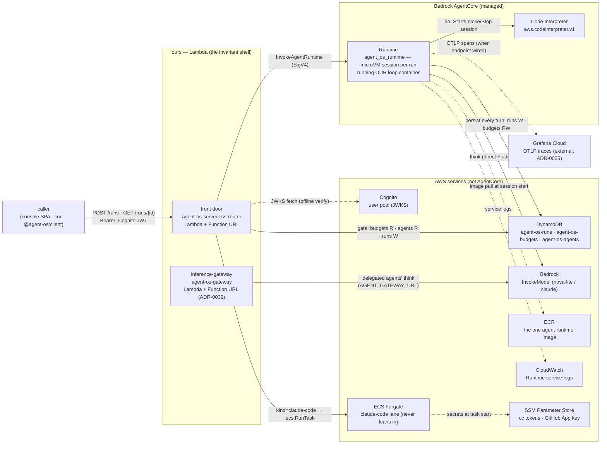
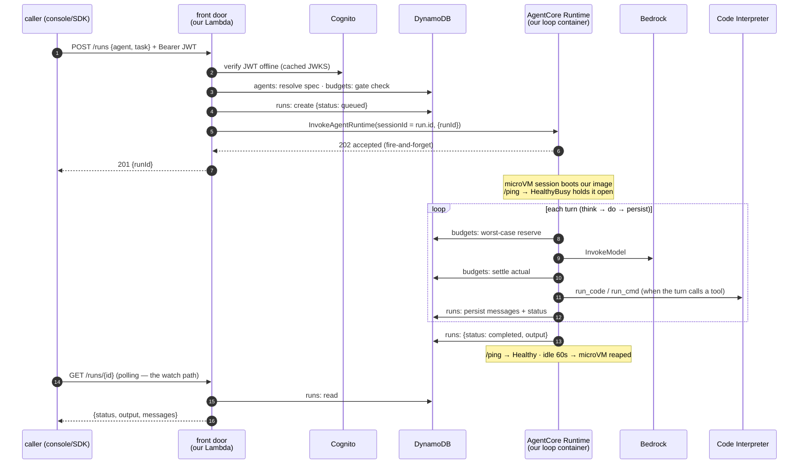

# The managed AgentCore profile — request flow & every AWS service touched

> **What actually gets hit, in order, when a run executes on the managed profile**
> (ADR-0042 phase 1: `DISPATCH=agentcore`). Companion to the
> [service comparison](agentcore-service-comparison.md) and the ADR; this is the
> *wire view*. One thing to hold onto throughout: **the front door is NOT
> AgentCore** — AgentCore has no inbound door (no webhook/HTTP ingestion; its
> Runtime is only reachable via the SigV4-signed `InvokeAgentRuntime` API), so
> the first thing a caller touches is always *our* router Lambda, in every
> profile.

## The service map — who owns what

Ownership in one line: the caller only ever talks to **our two Lambdas**; the
loop runs in **AgentCore Runtime** but is **our container**; state, money, and
identity stay on **DynamoDB + Cognito**; and the claude-code lane never leaves
**Fargate**.

## The run, step by step

## Where each AWS bill line comes from

| Service | Hit when | Profile delta vs Fargate |
|---|---|---|
| **Lambda** (router, gateway) | per request, ms-billed | unchanged |
| **Cognito** | JWKS fetch (cached), token issuance | unchanged |
| **DynamoDB** | gate check + create, then every turn (persist + reserve/settle), then every poll | unchanged |
| **AgentCore Runtime** | the whole run: vCPU-s **active only** (LLM-wait ≈ free) + GB-s incl. in-session idle (hence the 60 s idle reap) | **replaces** Fargate wall-clock for loop runs |
| **Bedrock** | one InvokeModel per turn | unchanged |
| **AgentCore Code Interpreter** | only turns that execute code | unchanged (both profiles use it) |
| **ECR** | image pull at session start | unchanged (same one image) |
| **ECS Fargate** | claude-code runs only | unchanged — this lane never leans in |
| **CloudWatch** | Runtime service logs (+ spans if no OTLP endpoint) | new small line |
| SSM | cc-lane secrets at task start | unchanged |

## FAQ the diagram answers

- **Is the front door AgentCore?** No. AgentCore has no inbound ingestion of any
  kind ([comparison](agentcore-service-comparison.md), cross-cutting absence #1);
  `InvokeAgentRuntime` requires a SigV4-signed AWS API call, so an
  internet-facing, JWT-authenticating, gate-running door has to be supplied — and
  it's the same router Lambda in every profile. What changes per profile is only
  what the router does *after* the gate: in-process worker (k8s), `ecs:RunTask`
  (serverless), `InvokeAgentRuntime` (managed).
- **Is the Function URL public?** Yes — `authType: NONE`, reachable by anyone,
  with authentication enforced at the **app layer**: no valid Cognito JWT ⇒ 401,
  fail-closed (verified live in the ADR-0039 smoke). Open CORS is safe here
  because the credential is a Bearer header, never a cookie — a foreign origin
  has nothing ambient to ride. The documented graduation is `AWS_IAM` on the URL
  (SigV4 *in front of* the app gate) if defense-in-depth is wanted.
- **Which boxes are AgentCore?** Exactly two in phase 1: Runtime (hosting *our*
  loop container) and Code Interpreter (already the default sandbox in the
  serverless profile). Phase 2–4 would add Memory, Gateway + Identity, and Policy.
- **Where's the budget gate?** Same two places as every profile: the front door
  (admission before a run exists) and inside the loop per turn (worst-case
  reserve → settle on `agent-os-budgets`). Nothing about it moved into AgentCore
  — nothing in AgentCore can hold it ([comparison §5](agentcore-service-comparison.md)).
- **What watches the run?** Polling `GET /runs/{id}` against the front door →
  DynamoDB, unchanged from ADR-0031/0032. Runtime's native streaming is a later
  upgrade, not part of this phase.
