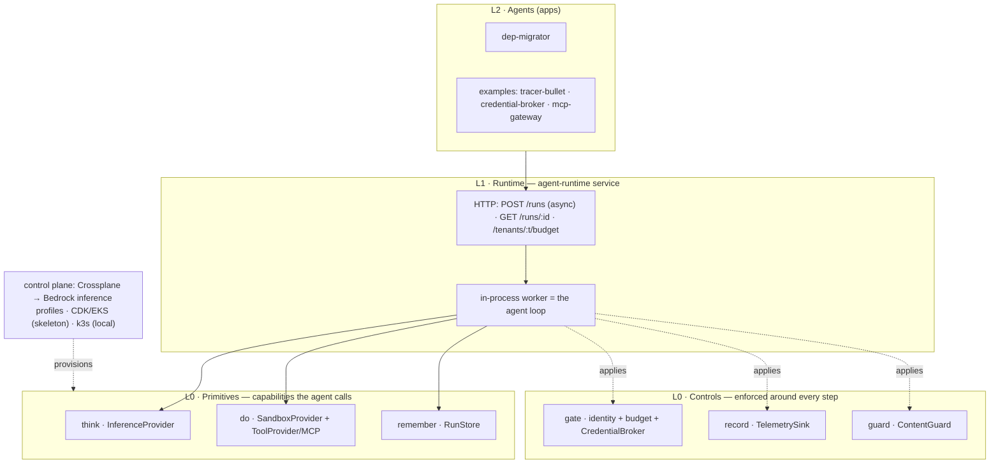

# agent-os architecture

Refined from the original bootstrap blueprint, with the four locked decisions
baked in and the blueprint's technical errors corrected.

## Locked decisions

| Decision | Choice | Implication |
|---|---|---|
| Tenancy | Internal, multi-team | Soft isolation + governance; trust operators, not code |
| Untrusted code | Yes | Runs in AgentCore (managed Firecracker-per-session) — see [isolation.md](isolation.md), ADR-0006 |
| Sandbox build vs buy | Buy: AWS Bedrock AgentCore | Control plane built on k8s; execution offloaded (ADR-0006) |
| Build approach | Thin-local first, behind ports | Each primitive/control runs locally now; managed AWS swap-ins documented, not all wired (see Implementation status) |

## Architecture at a glance

**Layered model** — primitives the agent *calls*, controls the platform *enforces*,
a runtime that composes them, agents on top:



**A run, end to end:**

```mermaid
sequenceDiagram
  actor Caller
  participant API as agent-runtime
  participant Gate
  participant Store as RunStore
  participant Loop as agent loop
  participant Think as Inference
  participant Tools as ToolProvider / MCP
  participant Broker as CredentialBroker
  participant Guard
  participant Rec as Telemetry

  Caller->>API: POST /runs  (Bearer token)
  API->>Gate: authenticate + checkBudget
  Gate-->>API: Principal {tenant,subject}  (else 401 / 402)
  API->>Store: create Run (queued)
  API-->>Caller: 202 {runId}

  Note over API,Loop: worker picks up the run (async)
  API->>Tools: resolve(principal) — policy filter + inject broker creds
  Tools->>Broker: issue scoped cred (server-side)

  loop until done or maxSteps
    Loop->>Guard: screen input / tool output
    Loop->>Think: generate(messages, tools)
    Think-->>Loop: text + toolCalls + usage
    Loop->>Tools: call tool (workspace / http / MCP)
    Loop->>Store: persist messages (per turn)
    Loop->>Rec: span per step
  end

  Loop->>Gate: recordSpend(cost from usage)
  Loop->>Store: final status + usage + costUsd
  Caller->>API: GET /runs/{id} → result
```

## Implementation status — logical design vs. what runs

> **Read the component names below as the *logical* architecture.** The services
> `inference-gateway`, `sandbox-manager`, `iam-authorizer`, `telemetry-processor`,
> and `tool-gateway` are **not yet separate services** — today their logic lives
> **in-process** as adapters inside [`@agent-os/core`](../packages/core), driven by
> the one running service, **`agent-runtime`**. The split into separate services is
> designed (their READMEs, the ADRs) but not yet done; the clean in-process
> composition is an assumption about how it decomposes, not yet tested.

Every primitive and control sits behind a port with a thin-local adapter; the
managed (mostly AWS) swap-ins are documented, several still unwired:

| Port (capability) | Thin / local — built & run | Managed swap-in — documented |
|---|---|---|
| `InferenceProvider` (think) | Ollama | **Bedrock** ✅ |
| `SandboxProvider` (do) | local temp-dir | **AgentCore Code Interpreter** ✅ |
| `ToolProvider` (do, tools) | built-in + MCP (stdio/HTTP) | AgentCore Gateway |
| `RunStore` (remember) | in-memory | DynamoDB / AgentCore Memory |
| `Gate` (gate) | static tokens + budget | AgentCore Identity / Auth0; Cedar/OPA |
| `CredentialBroker` (gate) | env grants | AgentCore Identity / Auth0 Token Vault; STS |
| `ContentGuard` (guard) | noop | **Bedrock Guardrails** ✅ |
| `TelemetrySink` (record) | console | **OTel/OTLP** ✅ → ADOT/OpenSearch |

✅ = both sides actually run. **Validated end-to-end:** a real agent
(dep-migrator) migrated a dependency; the budget gate returned `402`; the
credential broker kept a secret out of the model transcript; the MCP gateway
discovered + called a tool under per-tenant policy. **Not yet production:**
in-memory `RunStore`, static gate tokens + broker secrets, in-process
fire-and-forget worker, no eval harness, EKS/CDK still skeleton.

## The primitives

**3 primitives** (capabilities: think/do/remember) the agent calls directly +
**3 cross-cutting controls** (gate/record/guard) the platform enforces — all
behind ports ([ADR-0003](decisions/0003-ports-and-adapters.md)). Canonical model:
[`primitives.md`](primitives.md).

### 1. Inference (the brain) — *think*
Internal **inference-gateway** service abstracts the model provider (Bedrock, or
the Anthropic API directly). Handles fallback switching, rate-limiting, and
per-agent token-consumption metadata. Use **native provider prompt caching**
rather than a bespoke semantic cache in ElastiCache (better quality, less to own).

### 2. Sandbox (the hands) — *do*
**AWS Bedrock AgentCore** is the execution environment for untrusted code
(ADR-0006). `sandbox-manager` starts/keeps/stops **Code Interpreter** sessions —
each runs in a dedicated **Firecracker microVM** (own kernel/memory/network,
destroyed on session end), billed per-second with zero idle. The agent
orchestration loop stays in k8s (trusted, `runc`); only execution goes to
AgentCore. Crossplane provisions the named CodeInterpreter *config*; sessions are
runtime. **Egress** is set via AgentCore network mode (sandboxed vs allowlisted).
Behind the `SandboxProvider` port (ADR-0003), an EKS+gVisor adapter remains
possible if execution is ever in-sourced.

### 3. State / Memory — *remember*
Durable, possibly shared state across runs/agents — the agent's long-term memory.
Irreducible (can't be built on the other primitives — see [primitives.md](primitives.md));
backed by AgentCore Memory or a datastore (DynamoDB/Postgres/Redis/S3). **First use
is built:** the `RunStore` persists each run (status + conversation) per turn,
making runs async + durable. Cross-run/shared memory is still ahead. Distinct from
intra-session sandbox state (#2) and the loop's working state (L1).

### 4. Identity & governance (the guardrails) — *gate*
**EKS Pod Identity** (not IRSA) binds each sandbox's ServiceAccount to a scoped
IAM role. When an agent acts on behalf of a human, the platform mints a
**scoped, temporary session token** = intersection of (human's permissions ∩
agent's system limits). Per-team namespaces + ResourceQuotas + audit logging.
For **external services** (GitHub, OAuth providers), a **credential broker / token
vault** mints scoped third-party creds — see Tools & integrations below, ADR-0007.

### 5. Observability & tracing (the black box) — *record*
Apps emit **OTLP** spans (the `record` control / `TelemetrySink` port) for every
reason/tool-call/error with `agent_id`, `run_id`, `tokens_spent`, `tool_calls`.
**Topology:** app → in-cluster **ADOT Collector** (DaemonSet; optional gateway for
tail-sampling = cost control) → **OpenSearch** (traces) + **S3** (raw payloads).
App code is identical dev↔prod — only the OTLP endpoint changes (ADR-0003); the
collector is infra. Enables step-by-step replay of non-deterministic agent loops.

### 6. Safety / Guardrails (the filter) — *guard*
Is the *content* safe / allowed / grounded? (vs `gate` = actor/action authz.)
Applied to every `think` and every untrusted content crossing (tool/MCP/RAG output
→ model context — the injection defense).
- **Port `ContentGuard`; default adapter Bedrock Guardrails** (swappable — Llama
  Guard / NeMo / Presidio / LLM-as-judge): content filters (incl. Prompt Attack),
  denied topics, PII, contextual grounding; **ApplyGuardrail** screens any content
  independent of the model call.
- **Where:** enforced inline at `inference-gateway` (model I/O) + `tool-gateway`
  (untrusted output). Policy = a Crossplane-provisioned Guardrail config (future).
  See [ADR-0008](decisions/0008-guard-content-safety-primitive.md).

## Tools & integrations

Tool-calling and external APIs are **not** a new primitive — they compose from
`do` + `gate` (see [primitives.md](primitives.md)). Two new components:

- **`tool-gateway`** (serves *do*): an **MCP endpoint** + tool registry exposing
  internal APIs, external services, and other MCP servers as agent-callable tools,
  with per-tool policy. Backed by **AgentCore Gateway** (APIs/Lambda/services → MCP
  tools; 2- & 3-legged OAuth to protected MCP servers).
- **Credential broker** (serves *gate*, inside/beside `iam-authorizer`): a **token
  vault** of scoped, short-lived third-party creds (GitHub, Google, Slack…), minted
  per human × agent. Backed by **AgentCore Identity** (token vault, inbound +
  outbound auth, workload identity).

Behind ports `ToolProvider` + `CredentialBroker` (ADR-0003); AgentCore adapters
now, swappable later. See [ADR-0007](decisions/0007-tools-and-external-auth.md).

**Worked example — agent opens a GitHub PR:** loop decides to call `create_pr` (L1)
→ credential broker fetches the user's scoped GitHub token + policy check (*gate*)
→ call goes out via the tool-gateway/sandbox (*do*) → egress to `api.github.com`
allowlisted (*gate*) → call + result traced (*record*).

**Trust note:** a third-party MCP server is untrusted surface (a malicious tool
description/response can attempt prompt-injection or exfil), so the tool-gateway is
a governance chokepoint — vet/allowlist sources, scope the creds it can mint.

## Corrections to the original blueprint

| Issue in blueprint | Fix |
|---|---|
| `ec2:GetPulseDashboard` IAM action | Not real — removed |
| Karpenter Helm from `charts.karpenter.sh`, `settings.aws.*` | v1.x is an **OCI chart** (`oci://public.ecr.aws/karpenter/karpenter`); settings are flat (`settings.clusterName`, `settings.interruptionQueue`) |
| `defaultInstanceProfile: role.roleName` | Needs an actual `iam.InstanceProfile`; node role referenced from `EC2NodeClass` |
| IRSA (`addServiceAccount`) vs prose "Pod Identity" | Standardize on **EKS Pod Identity** |
| Sandbox subnet `PRIVATE_ISOLATED` ("no internet") | Agents need *controlled* egress → egress proxy, not zero egress |
| Semantic cache in ElastiCache | Prefer native provider prompt caching |

## Cost shape

- **POC:** control plane on **local k3s** (free) + AgentCore & Bedrock pay-per-use
  → **~$0 idle**. A Code Interpreter session is fractions of a cent; you pay only
  while code runs.
- **Prod:** EKS control plane (~$73/mo) + nodes for platform services + OpenSearch.
  No sandbox node fleet, no `.metal`, no Karpenter (for now).

## Control plane & portability (ADR-0003 / ADR-0005)

- **Kubernetes is the portable substrate.** Same K8s API everywhere — k3s locally
  (lean, for a 16GB Mac), EKS in prod. Karpenter is a prod-only add-on invisible
  to workloads. The platform services use **ports & adapters**; only the
  non-Kubernetes AWS dependencies are abstracted (selected by `AGENT_OS_PROFILE`).
- **Crossplane is the provisioning control plane.** CDK bootstraps day-0 (VPC,
  EKS, Crossplane + providers); Crossplane provisions day-2 per-tenant resources
  from CRDs (`InferenceProfile`, scoped IAM, Budgets). Self-service, no code
  change per team/model.
- **Provision vs. enforce.** Crossplane provisions infra (attribution + delayed
  Budget alerts); the inference-gateway enforces real-time cost caps. The CRD's
  `maxDailyCostUSD` is the single declarative source for both (ADR-0004).
- **Two control planes (don't conflate).** Crossplane is the control plane for
  *infra*; the **agent control plane** (planned, #5) is the control plane for
  *agents* — `agent-registry` (catalog: definitions, versions, config the runtime
  reads) + `agent-controller` (reconciles desired → running agents, operator-style).
  Neither is L0 or the L1 loop; they govern L2. See [primitives.md](primitives.md).

## Repository layout

```text
packages/   # @agent-os/core — the platform: ports, the L1 loop, runs, gate,
            #   credentials, tool-gateway, tools + adapters (where the "services"
            #   below currently live, in-process)
services/   # agent-runtime (REAL: async runtime + Dockerfile). inference-gateway,
            #   sandbox-manager, tool-gateway, iam-authorizer, telemetry-processor
            #   are README scaffolds — logic lives in core for now
apps/       # dep-migrator — the first real agent
examples/   # tracer-bullet · credential-broker · mcp-gateway (runnable, validated)
infra/      # AWS CDK (TypeScript via bun) — day-0 bootstrap; SKELETON, not deployed
deploy/     # local/ — k3s manifests (agent-runtime deployed live) + Crossplane
docs/       # this file, primitives.md, runtime.md, isolation.md, decisions/ (ADRs)
```

## Open design threads (not yet decided)

- Egress-proxy implementation (Squid/Envoy + allowlist? per-team policy?)
- "Human × agent" token-exchange mechanics and policy model
- Observability span schema + retention/PII handling for raw payloads in S3
- Whether Tier 2 ever lives on AWS `.metal` vs a non-AWS / GCP host
