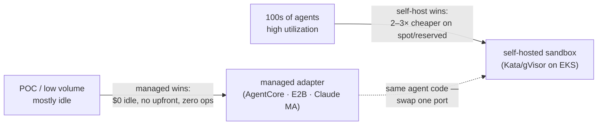

# agent-os — cost model & build-vs-buy

> The money view, companion to [`platform.md`](platform.md). What the options cost, where
> the crossover is, and why the platform is built to *ride the curve* rather than pick a side.
> All figures are **illustrative with stated assumptions**; vendor rates as of 2026-06-01 and
> change often — treat the *shape* as the takeaway, not the decimals.

---

## 1 · The one principle: tokens are a wash; runtime is the variable

You pay the **model provider for tokens regardless** of whether you run managed or self-hosted —
same Bedrock/Anthropic/Vertex token bill either way. So tokens drop out of a build-vs-buy
comparison. The *controllable* difference is everything around the model:

> **harness + sandbox compute + idle + ops** — that's the cost you actually choose.

At hundreds of agents, that runtime/sandbox compute is the dominant controllable line item.

---

## 2 · The "buy" options — managed agent platforms

| Platform | What you get | Headline price | Upfront? | Lock-in |
|---|---|---|---|---|
| **Claude Managed Agents** (beta) | Managed harness: cloud or self-hosted sandbox, tools, creds, scoped perms, tracing, per-tenant policy, stateful sessions | **$0.08 / session-hour** + tokens (+$10/1k web searches) | **none** | Claude-only; not ZDR/HIPAA-eligible |
| **Bedrock AgentCore** | Modular: Runtime, Memory, Gateway, Identity, Policy, Code Interpreter, Browser, Payments | **$0.0895/vCPU-hr** + $0.0094/GB-hr; Memory $0.25/1k; Policy $0.000025/req | **none** | AWS-only (multi-model via Bedrock) |
| **Gemini Enterprise Agent Platform** (Vertex Agent Engine) | Managed runtime, ADK + low-code Studio, memory, governance, 200+ models incl. Claude | **$0.0864/vCPU-hr** + $0.0090/GB-hr + $0.25/1k events; **50 vCPU-hr/mo free** | **none** | GCP-only |

All three are **pure consumption** — no setup fee, no minimum, no upfront commitment. That zero-upfront,
~$0-idle property is exactly why managed wins at POC scale.

---

## 3 · What managed does *not* give you (the requirements gaps)

Going all-in on a managed platform covers ~6–7 of the nine [requirements](platform.md#1--requirements--what-an-agentic-platform-must-do), but two structural gaps remain — and they're the two that justify agent-os existing:

- **R2 — real-time per-tenant budget hard-stop.** None offers a native pre-flight inference cap that
  stops a run mid-flight. AgentCore **Payments** (preview) has a `PaymentSession` ceiling, but it's
  commerce-oriented; Claude MA exposes only **org-level** spend limits. This is precisely [ADR-0019](decisions/0019-inference-gateway.md).
- **R6 — portability / no lock-in.** "All-in" *is* lock-in by definition (Claude-only / AWS-only / GCP-only).
- **R1/R5 — multi-tenant isolation + onboarding-as-policy** are only partial; you still build the claims/allowances layer.

So the decision is never purely cost — even if managed were free, it wouldn't meet R2/R6 alone.

---

## 4 · Unit economics — $/vCPU-hour

| | Effective $/vCPU-hour | Notes |
|---|---|---|
| **AgentCore / Vertex** | **~$0.09–0.11** | vCPU + ~$0.009/GB-hr; bills active CPU + peak mem |
| **Claude MA** | **~$0.08 / session-hour** | flat per session, not per-vCPU — cheap for modest boxes |
| **Self-host on-demand** | **~$0.048** | m5.xlarge $0.192/hr ÷ 4 vCPU (incl. 4 GB/vCPU) |
| **Self-host reserved / Savings Plan** | **~$0.029** | ~40% off on-demand, 1-yr commit |
| **Self-host spot** | **~$0.014** | ~70% off — the big lever |

**Managed compute ≈ 2× self-host on-demand, ≈ 5–7× self-host spot** on the raw rate. The managed
premium is the price of zero-ops and zero-idle.

---

## 5 · Worked example — migrate a big Python app to Go

**One migration** — 200 agents, ~4 h active each, ~2 vCPU / 4 GB → 800 session-hr / 1,600 vCPU-hr / 3,200 GB-hr (tokens excluded):

| Option | Cost | |
|---|---|---|
| Self-host **spot** (70% packing) | **~$31** | 1,600 × $0.014 ÷ 0.7 |
| **Claude MA** | **~$64** | 800 × $0.08 |
| Self-host **on-demand** | **~$110** | 1,600 × $0.048 ÷ 0.7 |
| **AgentCore / Vertex** | **~$170** | 1,600 × ~$0.088 + mem |

At *this* size, Claude MA's flat session price beats self-host **on-demand** and loses only to spot —
a one-off migration is **not** where self-hosting obviously wins.

**At scale** — 300 agents running ~continuously for a month (219,000 session-hr / 438k vCPU-hr):

| Option | Monthly | vs self-host spot |
|---|---|---|
| Self-host **spot** | **~$8.8k** | 1× |
| **Claude MA** | **~$17.5k** | ~2× |
| Self-host **on-demand** | **~$30k** | ~3.4× |
| **AgentCore** | **~$47k** | ~5.4× |

This is the at-scale story: the $0.03/run premium nobody notices at POC becomes **$10–40k/month**.

---

## 6 · The break-even rule

Self-host beats managed once fleet utilization clears `self_host_rate ÷ managed_rate`:

| Self-host pricing | Break-even utilization |
|---|---|
| **spot** | ~15% |
| **reserved / Savings Plan** | ~30% |
| **on-demand** | ~50% |

"Hundreds of agents running" means high sustained utilization — **well past every threshold**. So at
scale self-hosting wins; the lever is **spot + bin-packing**.

---

## 7 · Upfront & fixed costs

**Managed — no mandatory upfront**, but two things break the "pay only when running" intuition:
- *Optional commitments* (opt-in, for scale/discounts): Bedrock **Provisioned Throughput** (1–6 mo,
  for the rate-limit ceiling at hundreds of agents), AWS Savings Plans, Vertex Committed Use Discounts,
  Anthropic priority tiers, and possibly per-seat licensing on Gemini Enterprise.
- *Fixed-ish costs that accrue at idle:* stored memory/sessions ($0.25/1k), a **NAT gateway** if using
  AgentCore VPC mode (~$32/mo + $0.045/GB, 24/7), logging/egress/KMS, gateway-per-invocation.

**Self-host — the real upfront cost lives here:**

| | Upfront / fixed | When-idle |
|---|---|---|
| **Managed** | none (optional commitments only) | ~$0 (+ small storage/NAT) |
| **Self-host** | EKS control plane $73/mo · baseline nodes · **reserved commitments (1–3 yr)** · **engineering time to build + run the sandbox fleet** | pay for provisioned capacity 24/7 |

The genuine "upfront" isn't a vendor fee — it's the **engineering investment to build and operate the
self-hosted sandbox tier** (Kata/gVisor, autoscaling, spot-interruption handling, checkpointing) plus
any reserved-capacity commitment. That's the cost you *defer* by starting managed.

---

## 8 · The curve — and the architectural payoff

The whole point of the `SandboxProvider` port ([ADR-0003](decisions/0003-ports-and-adapters.md),
[ADR-0022](decisions/0022-sandbox-backends-for-coding-agents.md)) is that you **ride this curve without
a rewrite**: start managed for ~$0 idle, and when sustained volume makes the per-hour delta exceed your
ops cost, swap the adapter to self-hosted spot. The **agent-os shell stays constant** across that swap —
the gateway, budget hard-stop, identity, and tenancy that supply **R2 + R6**, which no managed platform
gives you. So agent-os isn't competing with the managed platforms; it's the thin, portable layer that
lets you use them as the cheapest-today option *and* keeps the two requirements they can't.

---

## 9 · Caveats

- Figures illustrative; instance mix, run length, and packing efficiency dominate the result.
- **Spot interruptions** hurt long, stateful migrations — realistic self-host lands nearer reserved
  (~$0.029) than pure spot once you add checkpointing/retry. Managed handles this for you.
- At hundreds of concurrent agents you'll hit **provider rate limits** → Provisioned Throughput (a
  capacity, not per-token, cost).
- Enterprise/committed terms are negotiated; pricing changes frequently — re-check before deciding.

Sources: [AgentCore pricing](https://aws.amazon.com/bedrock/agentcore/pricing/) ·
[AgentCore Payments](https://aws.amazon.com/blogs/machine-learning/technical-deep-dive-agentcore-payments-and-innovation-in-agentic-commerce/) ·
[Claude Managed Agents](https://platform.claude.com/docs/en/managed-agents/overview) ·
[Vertex/Gemini pricing](https://cloud.google.com/vertex-ai/pricing) ·
[AgentCore self-hosting analysis](https://scalevise.com/resources/agentcore-bedrock-pricing-self-hosting/).
