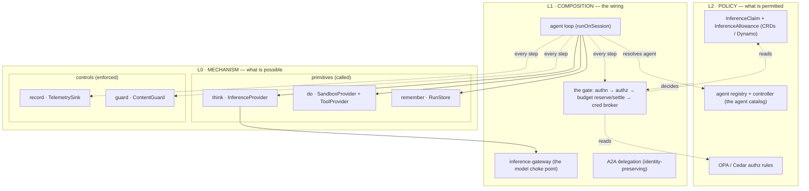

# agent-os — a view of an agentic platform

> This is the top-down narrative: **what an agentic platform must do, the shape that
> satisfies it, and how each piece is built.** It starts from requirements, derives a
> layered architecture, then drills into the primitives, their ports, and the layers
> that compose and restrict them. Every claim links to the code that backs it and the
> [ADR](decisions/README.md) that decided it.
>
> Want the slide-style version to present? See [`walkthrough.md`](walkthrough.md) — diagram +
> script per idea. Read this first for the prose. For the money view (managed vs self-hosted, at
> scale) see [`costs.md`](costs.md). For depth: [`primitives.md`](primitives.md) (the canonical L0 model),
> [`architecture.md`](architecture.md) (AWS mapping), [`runtime.md`](runtime.md) (the L1
> contract), [`resource-model.md`](resource-model.md) (every object → k8s + AWS).

---

## 1. Requirements — what an agentic platform must do

The two north stars are **it scales** and **it's secure**. A self-hosted, multi-tenant
platform that runs *untrusted, model-generated work on someone else's behalf* turns those
into nine concrete requirements:

| # | Requirement | Why it's hard for *agents* specifically |
|---|---|---|
| R1 | **Tenant isolation** — no tenant can use, see, or spend another's resources | The model decides what to do at runtime; isolation can't depend on the model behaving |
| R2 | **Real-time cost hard-stop** — stop *before* overspend, not a lagging bill | A looping agent can burn budget in seconds; cloud billing lags by hours |
| R3 | **Contained execution** — untrusted code runs isolated, with governed egress | The agent writes and runs its own code; it is hostile-by-default surface |
| R4 | **Verified, keyless identity** — identity is *proven*, never asserted, no static keys | An agent acts for a human *and* as itself — two identities on one call |
| R5 | **Onboarding scales without IaC** — get inference via a *claim*, not a terraform PR | One-tenant-per-PR doesn't scale to many short-lived agents |
| R6 | **Portable & swappable** — same code local and in prod; every dependency behind a port | A POC on a laptop must become EKS without rewriting the agent |
| R7 | **Observable** — non-deterministic loops are traceable and replayable | "Why did it do that?" is unanswerable without per-step traces |
| R8 | **Content screened at trust boundaries** — injection defense on every crossing | Tool/RAG output re-entering the model is an attack vector, not just model I/O |
| R9 | **Identity-preserving agent-to-agent calls** — delegation chain stays intact | Agent A calling agent B must not launder away *who* originally asked |

Everything below exists to satisfy one or more of these. The two **load-bearing** ones —
isolation (R1) and the cost hard-stop (R2) — are proven end-to-end on real EKS and local
k3s; the rest range from fully built to designed-and-stubbed (see [§7](#7-what-runs-vs-what-is-designed)).

---

## 2. The shape — three layers

The platform is **three layers**. The bottom splits into two *kinds* of foundation:
**primitives** (capabilities the agent *calls*) and **controls** (concerns the platform
*enforces around* every call). A runtime composes them; policy restricts them.

```text
  L2 · POLICY        claims · allowances · OPA rules · agent catalog
                     ── "what is a given tenant/agent ALLOWED to do?"
  ───────────────────────────────────────────────────────────────────────
  L1 · COMPOSITION   the agent loop · the gate (authn→authz→budget→creds)
                     the inference gateway · A2A delegation
                     ── "how the primitives + controls are wired into a run"
  ───────────────────────────────────────────────────────────────────────
  L0 · MECHANISM     think      do        remember   ← PRIMITIVES (called)
                    inference  sandbox    state
                     gate · record · guard           ← CONTROLS (enforced)
```

The key idea that separates this from "an agent framework": **L0 is mechanism, L2 is
policy, and they're different layers.** L0 says *what is possible* (you can call a model,
run code, spend money). L2 says *what is permitted* (this tenant may spend $50/mo on
Haiku, may call these tools). L1 is the wiring that puts the L2 decisions in front of the
L0 mechanism on every step. Restricting how the primitives are used is **not** a change to
the primitives — it's a layer on top.



---

## 3. L0 — the mechanism (primitives + controls)

Six foundations, each **irreducible** (can't be built from the others) and each **behind a
port** so the implementation is swappable ([ADR-0003](decisions/0003-ports-and-adapters.md)).
Calling something a primitive vs a control says *how the agent relates to it*, not whether
it's locked in.

### Primitives — capabilities the agent calls

| Primitive | Port | What the agent does | Backing |
|---|---|---|---|
| **think** · inference | `InferenceProvider` ([`ports.ts`](../packages/core/src/ports.ts)) | `generate(messages, tools, opts)` — one model turn → text + tool calls + token usage | Bedrock · the gateway · Ollama · scripted |
| **do** · sandbox | `SandboxProvider` ([`ports.ts`](../packages/core/src/ports.ts)) | `runCode` / `runCmd` / file ops in a persistent workspace | AgentCore Code Interpreter · E2B · local |
| **do** · tools | `ToolProvider` ([`tool-gateway.ts`](../packages/core/src/tool-gateway.ts)) | per-run toolset (built-in + MCP servers), policy-filtered, broker creds injected | built-in · MCP (stdio/HTTP) |
| **remember** · state | `RunStore` ([`runs.ts`](../packages/core/src/runs.ts)) | persist run status + conversation per turn (→ cross-run memory next) | in-memory · Postgres (+pgvector) · Redis ([ADR-0023](decisions/0023-memory-backends-postgres-redis.md)) |

> *Tools are the second face of `do`, not a fourth primitive* — they compose from `do` +
> `gate`. *State* is a genuine primitive: it's not inference (stateless), not sandbox
> (ephemeral), not a control — it needs its own store. First use is the `RunStore` that
> makes runs async + durable; cross-run/shared memory is the same primitive, ahead.

### Controls — concerns the platform enforces

| Control | Port | Enforced where | Backing |
|---|---|---|---|
| **gate** · identity + governance | `Authenticator` · `Authorizer` · `Gate` · `CredentialBroker` ([`gate.ts`](../packages/core/src/gate.ts)) | before every run + every tool call | see [§5](#5-l1--composition-the-wiring) — it decomposes |
| **record** · observability | `TelemetrySink` ([`ports.ts`](../packages/core/src/ports.ts)) | a span around every step (think/do/guard) | console · OpenTelemetry/OTLP |
| **guard** · content safety | `ContentGuard` ([`ports.ts`](../packages/core/src/ports.ts)) | model input, model output, **and** untrusted ingress re-entering context — tool output *and* retrieved memory | Bedrock Guardrails · noop (+ injection detector for code) |

`guard` and `gate` are different axes: **gate** asks *may this actor do this action?*;
**guard** asks *is this content safe / grounded?* Guard's injection defense is the
non-obvious one — it screens tool/RAG output *before* it re-enters the model, not just the
model's own I/O ([ADR-0008](decisions/0008-guard-content-safety-primitive.md)).

---

## 4. Ports & adapters — everything is swappable

Every primitive and control sits behind a port; the implementation is an **adapter**, chosen
by an environment variable ([ADR-0003](decisions/0003-ports-and-adapters.md)). This is what
makes R6 (portability) true: the agent loop is byte-identical on a 16GB laptop (k3s, local
adapters) and on EKS (managed AWS adapters) — only env changes. The default adapters are
AWS-native because that's the least-effort POC path, **not** because the model requires it.

| Port (capability) | Local / thin adapter | Managed swap-in | Selected by |
|---|---|---|---|
| `InferenceProvider` (think) | Ollama · scripted | **Bedrock** ✅ · the gateway ✅ | `INFERENCE_PROVIDER`, `INFERENCE_GATEWAY_URL` |
| `SandboxProvider` (do) | local temp-dir | **AgentCore** ✅ · **E2B** ✅ | `SANDBOX_PROVIDER` |
| `ToolProvider` (do/tools) | built-in + MCP | AgentCore Gateway | `MCP_SERVERS` |
| `RunStore` (remember) | in-memory | DynamoDB ✅ → **Postgres** ([ADR-0023](decisions/0023-memory-backends-postgres-redis.md)) | `RUN_STORE` |
| `Authenticator` (gate/authn) | static-token | **mesh-trust** ✅ · **OIDC-SA (TokenReview)** ✅ | `AUTHN` |
| `Authorizer` (gate/authz) | allow-all | **OPA** ✅ | `AUTHZ` |
| `Gate` + `SpendStore` (gate/budget) | local + in-memory | DynamoDB atomic ✅ → **Postgres** ([ADR-0023](decisions/0023-memory-backends-postgres-redis.md)) | `GATE`, `SPEND_STORE` |
| `ClaimSource` (gate/grants) | — | **Kube CRD** ✅ · **DynamoDB** ✅ | `CLAIM_SOURCE` |
| `CredentialBroker` (gate/creds) | env grants | **OBO token vault (RFC 8693)** ✅ | `CRED_BROKER` |
| `ContentGuard` (guard) | noop | **Bedrock Guardrails** ✅ | `GUARDRAIL_ID` |
| `TelemetrySink` (record) | console | **OTel/OTLP** ✅ → ADOT/OpenSearch | `TELEMETRY` |
| `AgentRegistry` (L2 catalog) | in-memory (JSON) | **Kube Agent CRs** ✅ | `AGENT_REGISTRY` |

✅ = both sides actually run. The full switchboard is [`config.ts`](../packages/core/src/config.ts)
(`providersFromEnv`), the single wiring seam: one provider set built at boot, no adapter
choice baked into the loop.

---

## 5. L1 — composition (the wiring)

L1 is where the primitives and controls become *a run*. "The agent" **is** this loop:
trusted code that decides → thinks → acts → remembers, with every step gated, recorded, and
guarded. Full contract in [`runtime.md`](runtime.md); the loop is [`loop.ts`](../packages/core/src/loop.ts).

**It ships two ways — same loop.** As a **library** (`@agent-os/core` — `import { runAgent }`,
runs in *your* process; what `apps/`+`examples/` use), or as the **`agent-runtime` service** (a
thin HTTP wrapper — `POST /runs`, an async worker runs the loop *for* you, poll `GET /runs/:id`;
the multi-tenant, centrally-governed front door). Lib = you host the loop; service = we host and
govern it. An agent itself is **defined once** as an `AgentSpec` (prompt, tools, model, budget —
the L2 config) and then **called per task** by name; one loop serves every agent (*define once,
call many*).

### The gate decomposes

The `gate` control is not one check — it's **four factored ports** the platform applies in
order, so each is independently swappable ([ADR-0015](decisions/0015-split-authn-authz-ports.md)):

```text
caller (with a credential)
  │
  ├─1 Authenticator.authenticate()  → Principal {tenant, subject, groups?, token?, actors?}
  │      verify who — not forgeable. tenant is the isolation boundary (R1).         (else 401)
  ├─2 Authorizer.authorize(principal, action)  → allow / deny                       (else 403)
  │      may this actor do this? (OPA/Cedar) — separate from authn.
  ├─3 Gate.reserve(tenant, worstCaseUsd, {sessionId})  → atomic admission           (else 402)
  │      worst-case cost ≤ remaining, checked atomically across scopes (R2).
  │      ... the model call runs ...
  │      Gate.settle(tenant, actual − reserved)   reconcile the reservation.
  └─4 CredentialBroker.issue(principal, target)  → scoped, short-lived downstream cred
         applied by tools SERVER-SIDE, so the model never sees the secret.
```

- **Identity is verified, not asserted (R4).** The production authenticator does a real
  Kubernetes `TokenReview` of the caller's ServiceAccount token — the cluster API confirms
  it ([`oidc-sa-authenticator.ts`](../packages/core/src/adapters/oidc-sa-authenticator.ts),
  [ADR-0019](decisions/0019-inference-gateway.md)). The `tenant` is then resolved from a
  *claim binding* (data), never from a token claim the caller could forge.
- **The budget hard-stop is atomic (R2).** `reserve` is a single conditional DynamoDB write
  — `ADD spentUsd` with `ConditionExpression spentUsd ≤ ceiling` — so check-then-spend can't
  race. It's **multi-scope**: a tenant/month cap *and* an optional per-session cap (the
  runaway-session stop). The caller reserves the *worst case* (maxTokens × price) up front
  and settles the delta after ([`gate.ts`](../packages/core/src/gate.ts),
  [ADR-0013](decisions/0013-inference-cost-enforcement.md)). Breach → `BudgetExceededError`
  → HTTP 402.
- **Secrets never reach the model (R4).** The broker mints a scoped, short-lived credential
  for the run's `Principal`; the tool applies it server-side
  ([ADR-0010](decisions/0010-credential-broker.md)).

### The inference gateway — the model choke point

Every `think` routes through a standalone **inference-gateway** service that is the *sole
holder of model credentials* — no caller has `bedrock:InvokeModel` itself
([ADR-0019](decisions/0019-inference-gateway.md)). This is what makes R1 + R2 enforceable:
isolation and the budget hard-stop live at one privileged point that callers can't bypass,
instead of being scattered across every workload. It runs in two modes behind the same port —
in-process (the runtime assumes the tenant role + admits locally) or as the remote HTTP
service (`INFERENCE_GATEWAY_URL`) — and it's deliberately *dumb* (no agent loop, no tools, no
sandbox) so the high-value target has minimal surface.

### A run, end to end

```mermaid
sequenceDiagram
  actor Caller
  participant API as agent-runtime
  participant Gate
  participant GW as inference-gateway
  participant Loop as agent loop
  participant Sand as sandbox / tools
  participant Guard
  participant Rec as telemetry

  Caller->>API: POST /runs (verified identity)
  API->>Gate: authn → authz → reserve(worst-case $)
  Gate-->>API: Principal {tenant,subject}   (else 401/403/402)
  API-->>Caller: 202 {runId}   (async; poll GET /runs/:id)

  loop until done / maxSteps
    Loop->>Guard: screen input + untrusted tool output
    Loop->>GW: generate(messages, tools)   ← sole model credential holder
    GW->>Gate: reserve/settle (budget hard-stop)
    GW-->>Loop: text + toolCalls + usage
    Loop->>Sand: run code / call tool (broker injects creds server-side)
    Loop->>Rec: span per step
  end
  Loop->>Gate: settle final spend
```

### Agent-to-agent (R9)

When agent A calls agent B, the call carries the **delegation chain** in `Principal.actors`
(most-recent agent first) while `subject` stays the originating human — so B's gate sees
*who originally asked* and *which agents are in the chain*, and applies its own budget +
policy at the hop. The transport is the open **A2A protocol** (Agent Card discovery +
JSON-RPC `message/send`), not a bespoke call ([ADR-0017](decisions/0017-a2a-identity-propagation.md),
[ADR-0018](decisions/0018-a2a-protocol-transport.md)).

---

## 6. L2 — policy (what is permitted)

L0 says inference is *possible*; L2 says *this tenant may spend $50/mo on Haiku*. This is the
layer that restricts how the primitives and controls are used — and it's deliberately
**data, not provisioning**.

### Onboarding is policy, not provisioning

The original assumption was that a tenant needs a *provisioned AWS bundle* (role + profile +
budget, via terraform/Crossplane) before it can do inference — which doesn't scale to many
short-lived agents (R5). With the gateway holding the model credential, a tenant needs no AWS
of its own: it just asserts an **`InferenceClaim`** — *I want model X with a $Y budget* — as
data ([ADR-0021](decisions/0021-inference-onboarding-policy.md)). Per-tenant AWS becomes
opt-in.

The claim is read through the **`ClaimSource`** port, so the same gateway works whether grants
live in a Kubernetes CRD or a DynamoDB table:

- **Kubernetes path** — a namespaced `InferenceClaim` CR (tenant = namespace, so a tenant can
  only grant its own ServiceAccounts). An admin-set `InferenceAllowance` caps budget + allowed
  models; a **ValidatingAdmissionPolicy** enforces *claim ≤ allowance* at apply time
  (controller-free, CEL); a **claims-controller** sums each namespace's claims and writes
  `status.conditions[Ready]` (the cross-object check a VAP can't do). The gateway honours only
  non-rejected claims.
- **Non-k8s path** — grants in a DynamoDB table for workloads that aren't pods. A self-service
  **`POST /claims`** lets a service register *its own* grant: it authenticates, the gateway sets
  **tenant = its verified identity (1:1)** — you can't forge your own identity, so you can't
  grant yourself someone else's tenant — and the requested model + budget are validated against
  a default allowance before the write.

### Action policy + the agent catalog

- **Authorization** is OPA/Cedar behind the `Authorizer` port — allow/deny rules over
  `(principal, action, resource)`, decided outside the loop
  ([ADR-0015](decisions/0015-split-authn-authz-ports.md)).
- **The agent control plane** ([ADR-0012](decisions/0012-agent-control-plane.md)) is L2's
  catalog: an **`agent-registry`** (declarative truth — what agents exist, their model/tools/
  limits, read by L1 to resolve a request → an agent) and an **`agent-controller`** (an
  operator that reconciles `Agent` CRs and writes status). It governs the *population* of
  agents; it's neither a primitive nor the loop.

> **PEP/PDP split.** The controls (gate/guard) are the *enforcement* points (PEP); claims,
> allowances, and OPA rules are the *decisions* (PDP). L2 changes a decision; L0/L1 enforce
> it unchanged. That's why restricting usage is a new layer, not a new primitive.
>
> **Invariant vs value.** Distinguish the two kinds of limit: *that* a limit exists — every call
> gated, every run budgeted, sessions capped, only reachable models — is a **platform invariant**
> baked into L0/L1 (the control always runs; not an optional knob). L2 only fills in the *value*
> inside that invariant — the budget number, the allowed-model set — partly admin-set (the
> `InferenceAllowance` ceiling) and partly tenant self-service (the `InferenceClaim` within it).

---

## 7. What runs vs what is designed

Honest status — the logical architecture names components that aren't all separate services yet.

**Real services (have code + run):**

| Service | Role | ADR |
|---|---|---|
| `agent-runtime` | the L1 runtime — `POST /runs` (async), the worker loop, A2A | 0012, 0017/0018 |
| `inference-gateway` (LiteLLM) | the model choke point, **full mode**: the bought engine carrying our OSS hooks — verified-identity authn + worst-case budget admission, OpenAI **and** Anthropic wire | 0019, 0024, 0026 |
| `inference-gateway` (Bun) | the same gate, **cheap mode / reference impl**: bespoke `/v1/generate`, `POST /claims` self-service — kept for scale-to-zero, not retired | 0019, 0021, 0027 |
| `agent-controller` | reconciles `Agent` CRs → status | 0012 |
| `claims-controller` | aggregate quota over claims vs allowance → status | 0021 |

**Designed, logic currently in-process as `@agent-os/core` adapters (not yet split out):**
`sandbox-manager`, `tool-gateway`, `iam-authorizer`, `telemetry-processor` — their READMEs +
ADRs define the split; it isn't done.

**Proven end-to-end:** verified workload identity (OIDC TokenReview, on real EKS and local
k3s) · the budget hard-stop returning 402 · the credential broker keeping a secret out of the
transcript · the MCP gateway discovering + calling a tool under per-tenant policy · cross-pod
A2A with on-behalf-of identity (CloudTrail-confirmed on EKS) · apply-time CEL rejection of a
bad claim · **the LiteLLM gateway live against Bedrock**: verified identity → claim → worst-case
reserve → Claude Haiku 4.5 → settle-to-actual, including the **forgery defense** (a request
*claiming* tenant A with a token *proving* B spends as B) and **both wire formats** (OpenAI +
Anthropic `/v1/messages`) through the same hooks · the **Postgres budget reserve** (one
conditional `UPDATE`) validated locally **and** on **Aurora Serverless v2 scale-to-zero**
(`make deploy-postgres`, pauses to $0 compute after 5 idle min).

**Sandbox egress lockdown — slices 1–2 proven (local k3s):** *(1, the wall)* default-deny
egress + a gateway door + DNS — the sandbox reaches the gateway (200), every internet
destination is blocked, DNS still resolves. *(2, the named-domain door)* a Squid forward proxy
the sandbox is forced through: allowlisted registries (`.npmjs.org`/`.pypi.org`) tunnel,
non-listed (`github.com`) get a recorded `TCP_DENIED/403`, a direct bypass dies at the wall.
The `do` containment control ([ADR-0020](decisions/0020-sandbox-execution-model.md)/[0022](decisions/0022-sandbox-backends-for-coding-agents.md));
`make sandbox-test` (deployed by the `charts/sandbox` Helm chart).

**Gate conformance — both gateways agree (ADR-0027):** a suite (`make gate-conformance`) asserts
the load-bearing contract — R1 (no/bad credential → 401) + R2 (no `max_tokens` → 400, worst-case
> budget → 402) — holds *identically* on the Bun bespoke gateway (cheap mode) and the LiteLLM
OpenAI-wire gateway (full mode), each in its own dialect. 4/4 identical; the one profile
difference (un-claimed identity → cheap-mode flat-budget vs full-mode default-deny) is reported,
not failed — "same contract, only richness differs."

**Research-as-a-tool — built (Model A, the first customer):** `webResearchTools` (`fetch_url`
+ pluggable `web_search`) — the trusted loop calls it *outside* the zero-egress sandbox and
guards the result as untrusted ingress; the tool enforces SSRF safety (no private/metadata
hosts), refused redirects, and a per-tenant domain allowlist. The inbound mirror of egress
lockdown.

**Not yet:** cross-run/shared memory (Postgres + pgvector, [ADR-0023](decisions/0023-memory-backends-postgres-redis.md))
· gVisor/Kata runtime isolation on EKS + the Model-B research routing
([ADR-0022](decisions/0022-sandbox-backends-for-coding-agents.md))
· repointing the **RunStore** off DynamoDB to Postgres (the SpendStore
half is done) · Aurora **IAM-auth** token refresh (keyless DB connections) · the gateway
**conformance suite** ([ADR-0027](decisions/0027-two-deployment-profiles.md)) · IAM-SigV4/OIDC
verifiers for non-k8s callers · mesh-trust authn · scale-out (deferred) · EKS/CDK still mostly
skeleton (the `AgentOsPostgres` stack is real).

---

## 8. The decisions behind it

Each layer above is the consequence of a recorded decision. The full set:
[`decisions/README.md`](decisions/README.md). The load-bearing ones for this narrative:

| Theme | ADRs |
|---|---|
| **Foundation** — ports/adapters, EKS, AgentCore | [0003](decisions/0003-ports-and-adapters.md) · [0001](decisions/0001-build-on-eks-karpenter.md) · [0006](decisions/0006-agentcore-execution-environment.md) |
| **The controls** — guard, gate, authn/authz split | [0008](decisions/0008-guard-content-safety-primitive.md) · [0009](decisions/0009-gate-identity-and-governance.md) · [0015](decisions/0015-split-authn-authz-ports.md) |
| **Memory (remember)** — Postgres/Redis backends + the guard ingress it adds | [0023](decisions/0023-memory-backends-postgres-redis.md) |
| **Cost (R2)** — attribution → enforcement → the gateway | [0004](decisions/0004-cost-governance.md) · [0013](decisions/0013-inference-cost-enforcement.md) · [0019](decisions/0019-inference-gateway.md) |
| **Identity (R1, R4, R9)** — per-tenant identity, creds, A2A | [0014](decisions/0014-per-tenant-workload-identity.md) · [0010](decisions/0010-credential-broker.md) · [0016](decisions/0016-obo-token-vault.md) · [0017](decisions/0017-a2a-identity-propagation.md) · [0018](decisions/0018-a2a-protocol-transport.md) |
| **Tools & sandbox (R3)** — tools/auth, MCP gateway, sandbox model, coding-agent backends | [0007](decisions/0007-tools-and-external-auth.md) · [0011](decisions/0011-tool-mcp-gateway.md) · [0020](decisions/0020-sandbox-execution-model.md) · [0022](decisions/0022-sandbox-backends-for-coding-agents.md) |
| **Onboarding (R5)** — control plane, policy-not-provisioning | [0005](decisions/0005-crossplane-control-plane.md) · [0012](decisions/0012-agent-control-plane.md) · [0021](decisions/0021-inference-onboarding-policy.md) |
| **Build-vs-buy, executed** — buy the engine (LiteLLM) / build the policy (OSS hooks); cost buckets in the ledger; the hot path; two deployment profiles | [0024](decisions/0024-build-vs-buy-managed-agent-platforms.md) · [0025](decisions/0025-cost-allocation-in-the-ledger.md) · [0026](decisions/0026-gateway-hot-path-authn-authz-budget.md) · [0027](decisions/0027-two-deployment-profiles.md) |
