# agent-os — the stack (ideas)

> Diagram-per-idea, no speaker notes. This deck is **ideas, not a demo** — what an
> agentic platform actually needs. I built each piece to *understand* it; the building
> was the way in, not the point. For the prose reference see [`platform.md`](platform.md)
> and [`primitives.md`](primitives.md).

---

## 1 · The harnesses we use every day

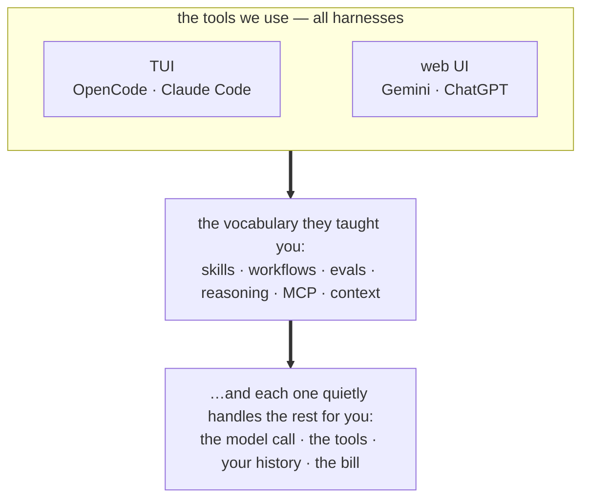

*These are the tools we use every day — and each one quietly handles a lot underneath. This deck names what they handle, so the words mean the same thing for all of us.*

---

## 2 · Agent vs harness

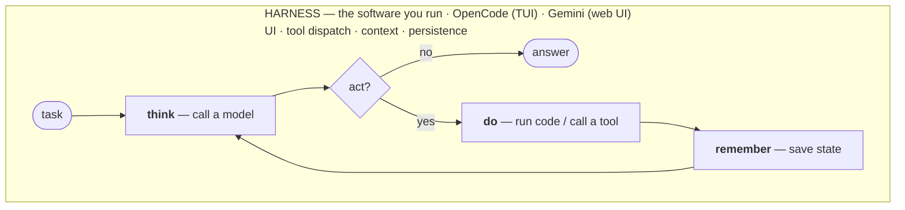

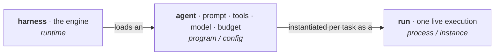

*The harness runs the loop above. An **agent** is a *configuration* of that loop — a purpose: prompt + tools + model + budget. A **run** is one execution of it. So: **engine → program → process** — one harness runs many agents; each agent spawns many runs. (A harness can also run *non*-agentic flows — one question, one answer, no loop.)*

---

## 3 · The picture — it's a stack

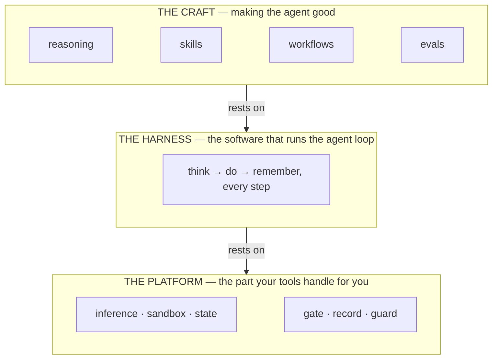

*The craft sits on a harness; the harness sits on a platform. Strip the vocabulary and most of the craft is just a way to arrange `think`, `do`, `remember`. Take a layer away and everything above it falls.*

---

## 4 · The platform — two kinds of foundation

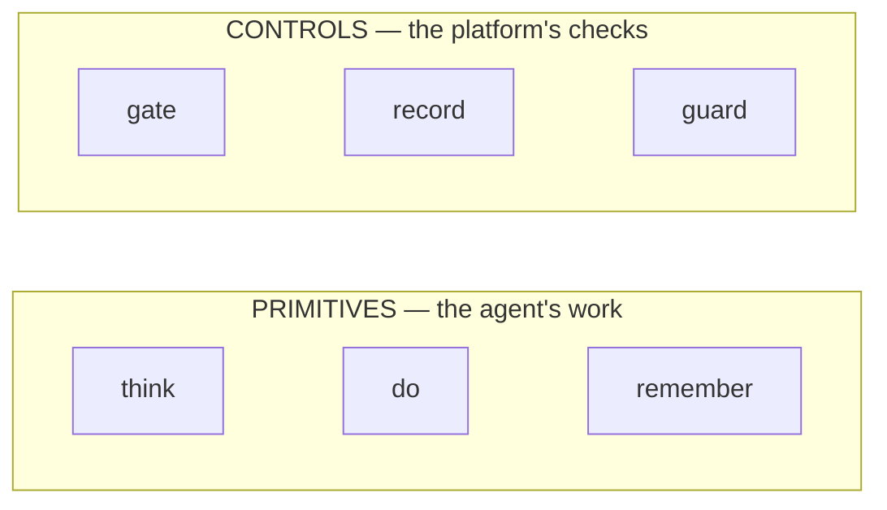

*A **primitive** is an irreducible capability the agent acts with to make progress — one you can't build from the others. Test — **delete it**: can't make progress = a **primitive** · runs but ungoverned = a **control**. Same split as k8s: pods vs RBAC + quota + admission.*

---

## 5 · Free at n=1, fatal at n>1

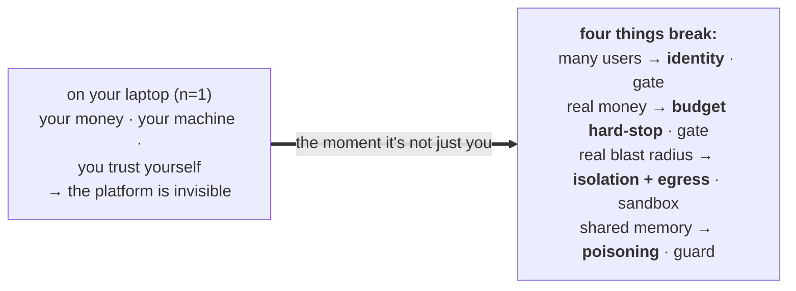

*The platform is everything your laptop hands you for free at n=1 and that becomes fatal at scale — so the tools never make you think about it. Each of the four is a load-bearing part I only believed once I'd built it and watched it matter.*

---

## 6 · That's the idea — now here's how we build it

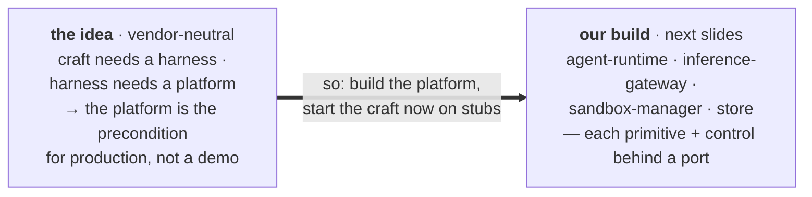

*Everything up to here is true of **any** agentic platform. From here it's **our** implementation of it — the same six parts, named as components. The craft is necessary but not sufficient; the platform is what makes it survive production; the seam (ports) is what lets us build it without blocking the craft.*

---

## 7 · Architecture — where it sits, how it interacts

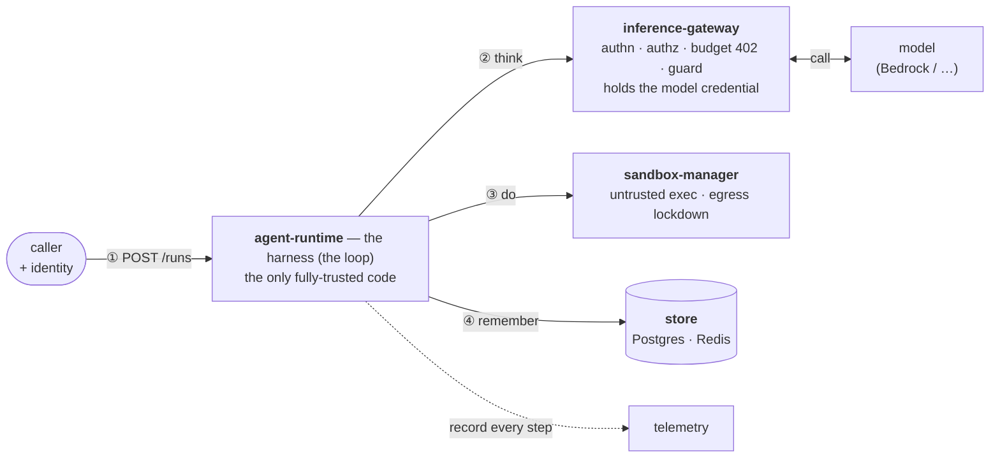

*The runtime is the loop; ②–④ repeat until done. The gateway is the choke point — the only thing holding model credentials and the only place spend can be stopped (402). The sandbox is where untrusted code runs, never the runtime.*

---

## 8 · The same architecture, in a harness we use

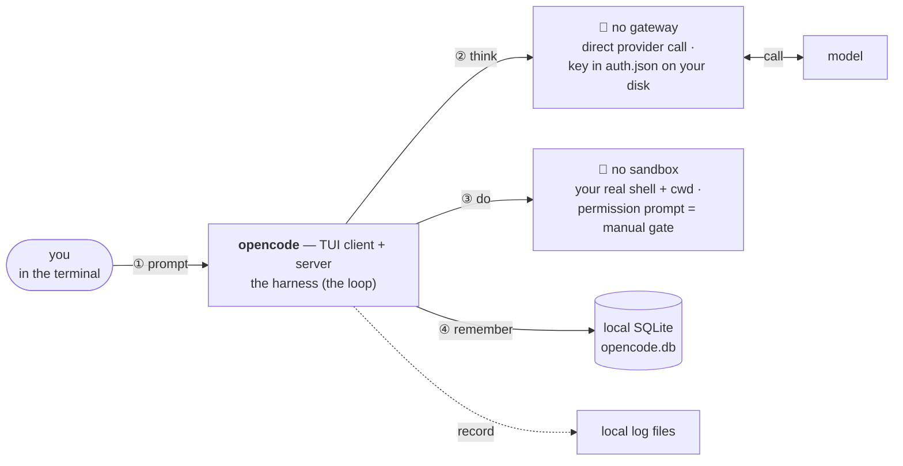

*Same harness, same loop — but the **entire platform layer collapsed to local** because n=1: gateway → a key on disk, sandbox → your real machine, store → one SQLite file, telemetry → a log file. The boxes that vanished are exactly the four that break at scale (slide 5). The platform **is** the gap between "opencode on my Mac" and "opencode for 200 engineers running untrusted code on a budget."*

---

## 9 · The seam — stub today, swap later

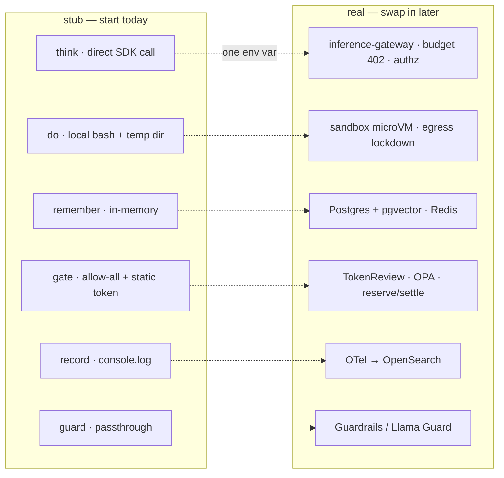

*Same port, different adapter — chosen by config ([ADR-0003](decisions/0003-ports-and-adapters.md)). The craft never knows which one it's talking to.*

---

## 10 · So we build in parallel

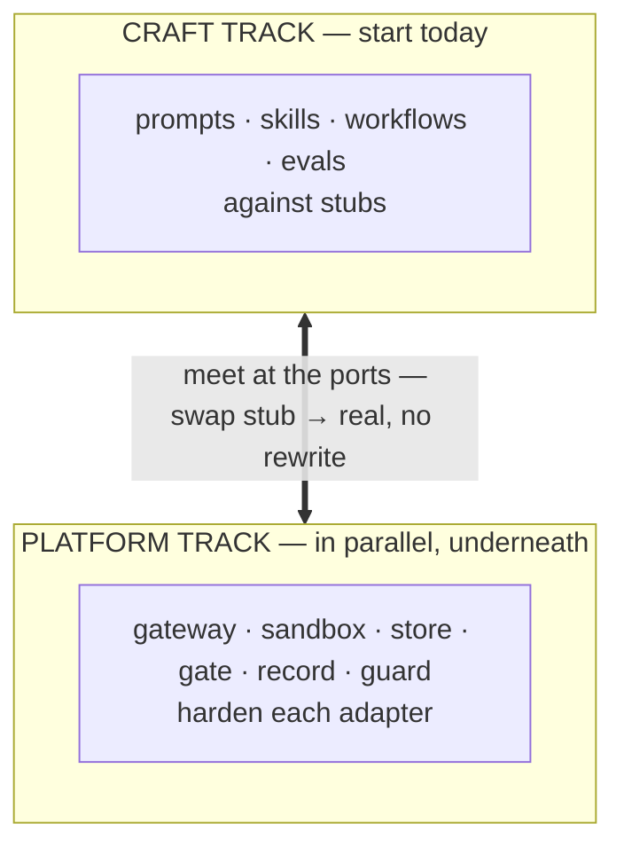

*Works only if the stubs honor the real **contract** — its failures and limits, not just the happy path: the stub `gate` must sometimes **402**, the stub `do` must **lock egress**, state must be **async** (submit→poll) from day one. Stub the happy path only and 'parallel' just defers integration to the worst possible moment.*

---

## 11 · What we're building — and what's still open

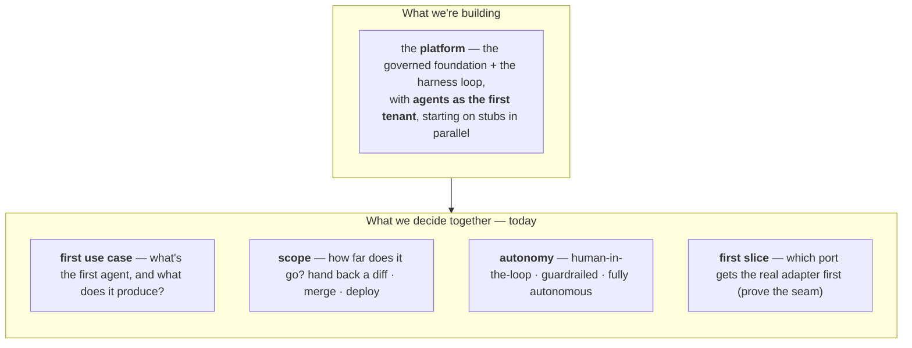

*The shape is settled; the boundaries are this meeting. Pick the first use case, how far it's allowed to go, and the first vertical slice — then the craft track and the platform track both start Monday.*

---

# Backup

## B1 · Why the craft isn't a primitive or a control

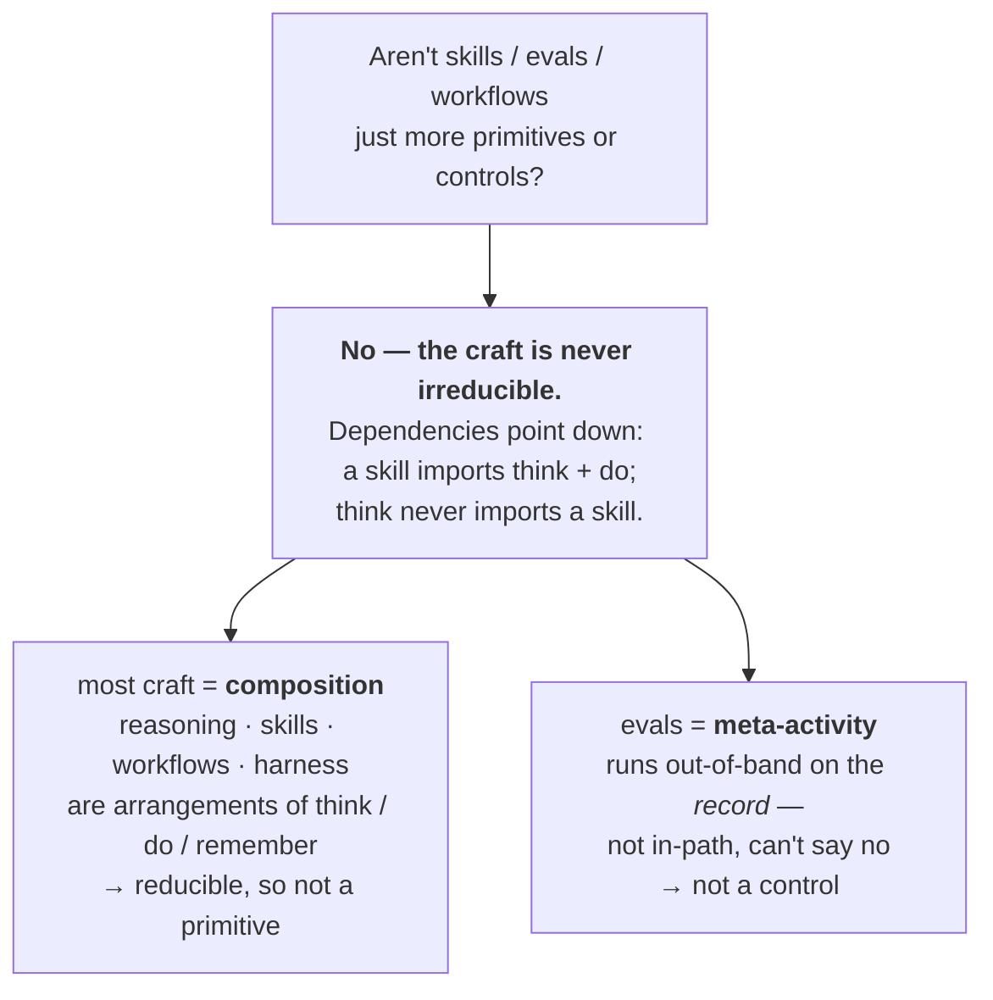

*Position, not function: the same LLM-judge is an **eval** scoring yesterday's runs — or, moved in-path at the gateway where it can block, it's **guard**. What makes a control is where it sits, not what it does.*

---

## B2 · Glossary — the terms, placed on the stack

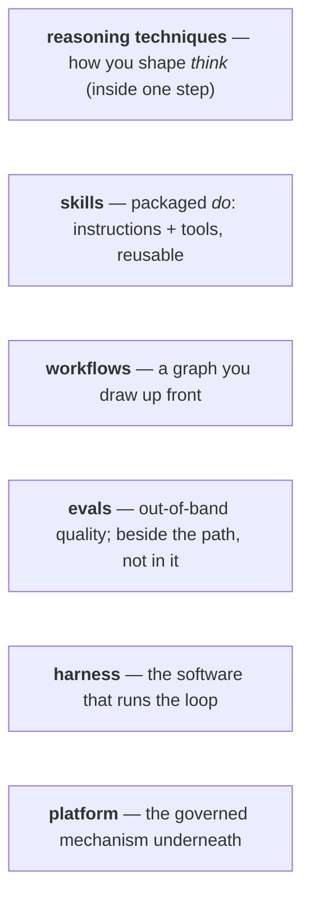

*Strip the vocabulary and most of it is a way to arrange `think`, `do`, `remember`.*

---

## B3 · If not primitives, then what?

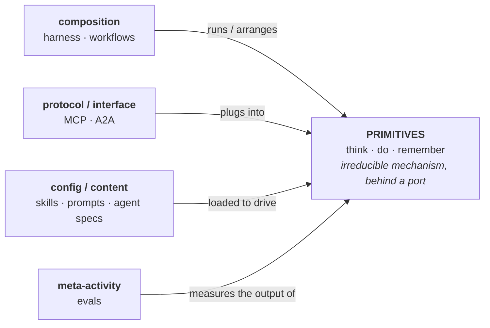

*A primitive is irreducible mechanism; everything else is defined **relative** to it — it **runs** it (harness), **plugs into** it (MCP), **packages** it (skills), or **measures** it (evals). Pull `do` out and MCP has nothing to connect to, skills nothing to invoke, the harness nothing to loop over — they can't return the favor.*
