# agent-os — diagrams only

> Diagram-per-idea, no speaker notes. For the narrated version see [`walkthrough.md`](walkthrough.md);
> for the prose reference see [`platform.md`](platform.md); for the cost model see [`costs.md`](costs.md).

---

## 1 · The premise

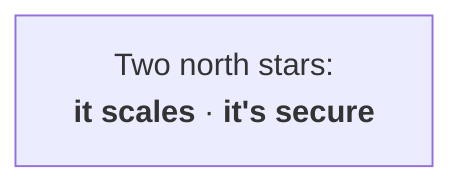

---

## 2 · Why agents are hard

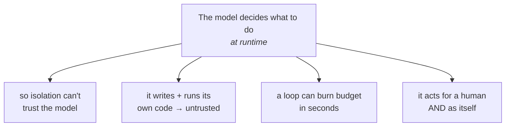

---

## 3 · The whole thing in three layers

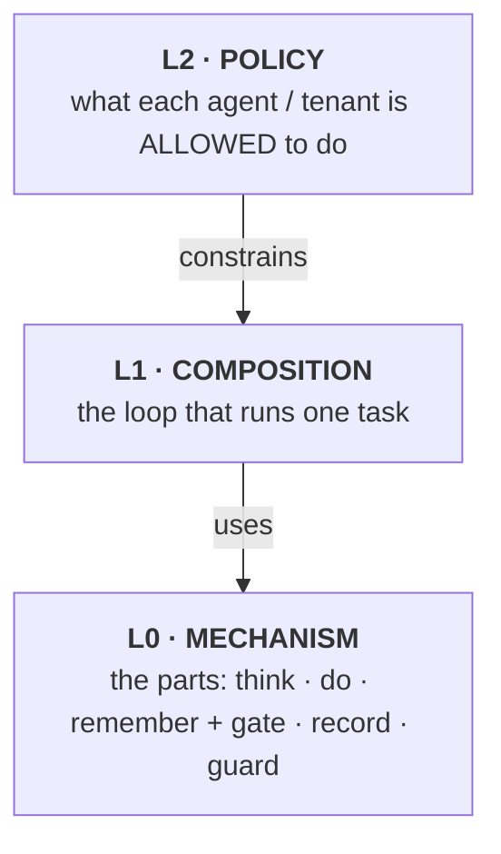

---

## 4 · First, watch one task run — the loop (this is "the agent")

*The bold steps — **think · do · remember** — are the **primitives** (the agent's work); the **guard** wrapping them is a **control** (the platform's check). We name the parts next.*

---

## 5 · L0 — the parts

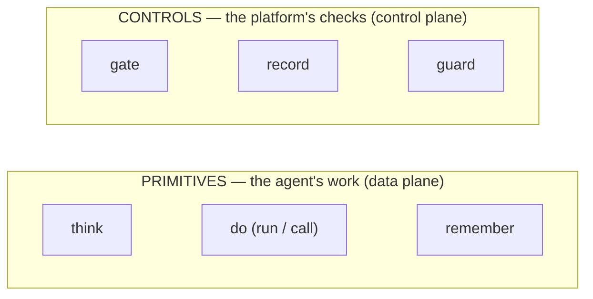

*Test — **delete it**: can't make progress = a **primitive** (the agent's work) · runs but ungoverned = a **control** (the platform's checks). Same split as k8s: pods vs RBAC + quota + admission.*

*Controls wrap primitives — the **gate** admits + meters each `think` (the 402); **guard** screens what crosses into it; **record** traces every step.*

---

## 6 · The three primitives

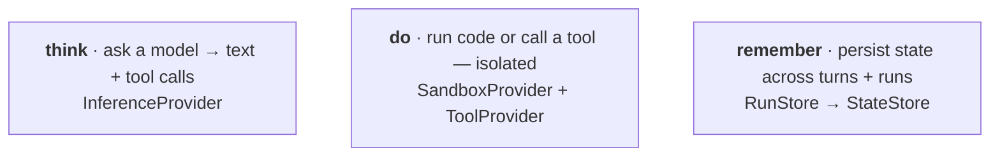

---

## 7 · The three controls

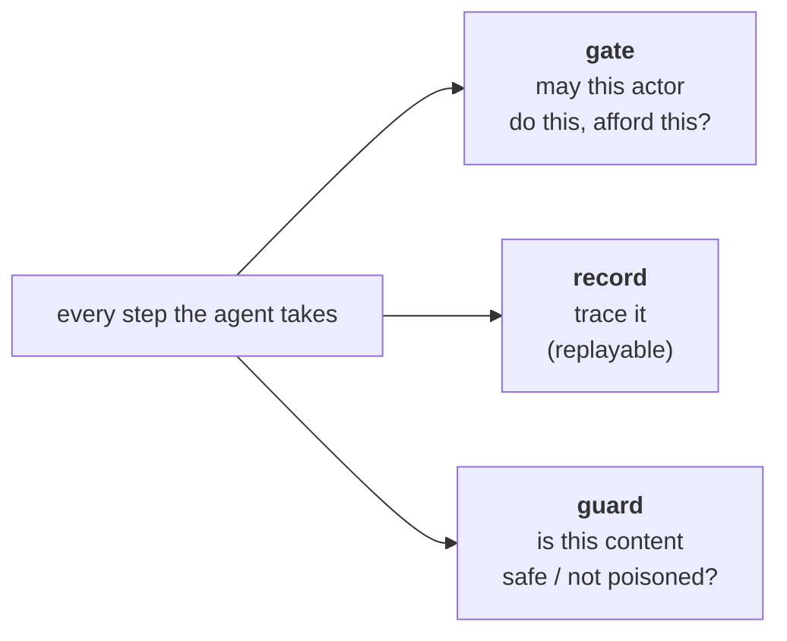

---

## 8 · Everything is swappable

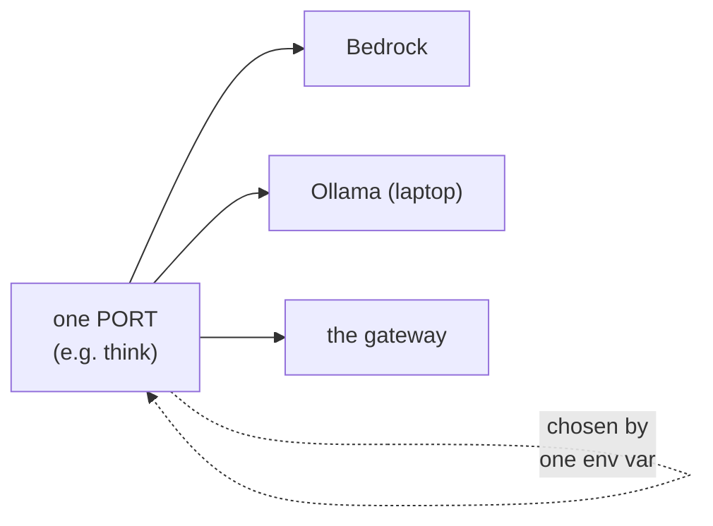

---

## 9 · The gate, opened up

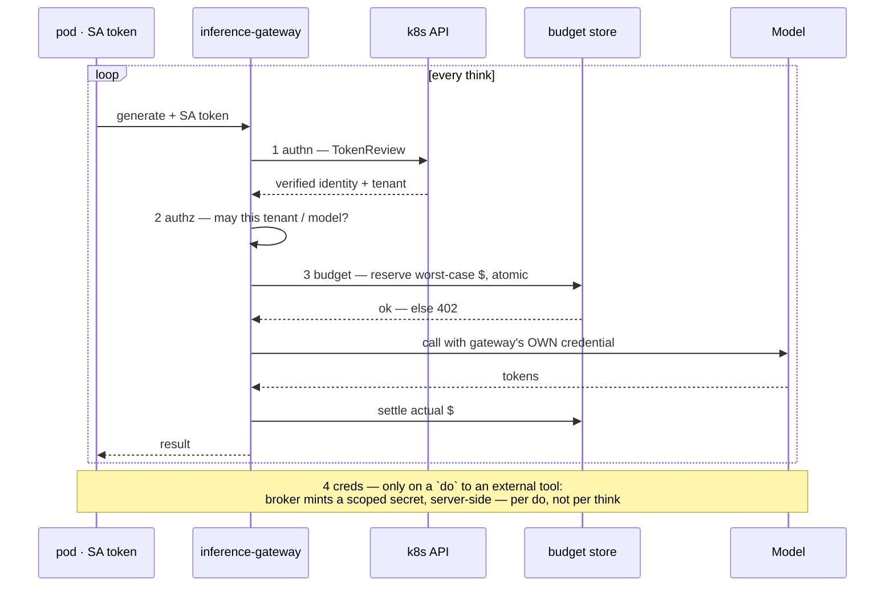

---

## 10 · A run, end to end

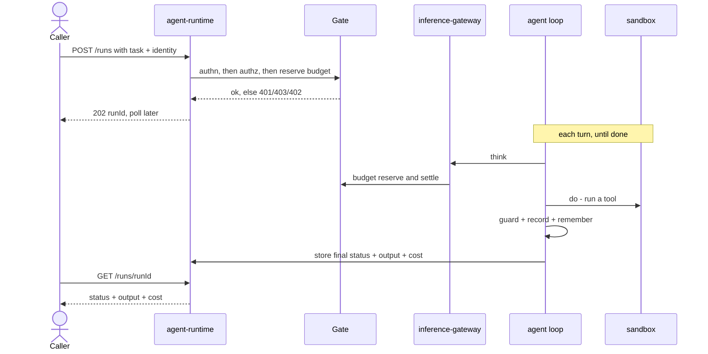

---

## 11 · L1 vs L2 — one engine, many agents

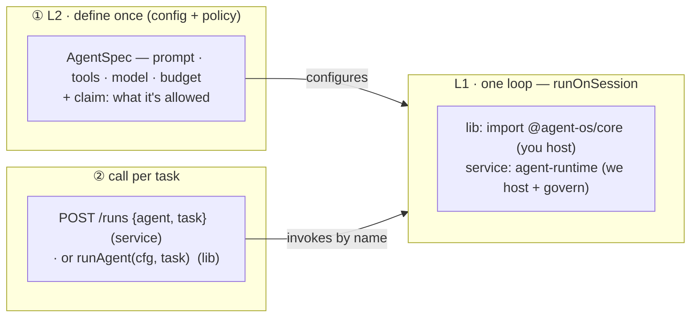

*L1 = one loop, shipped as a lib or a service. L2 = define the agent once (config + policy), then call it per task — define once, call many; the same loop serves every agent.*

---

## 12 · L2 — policy sets the values; the platform enforces the limits

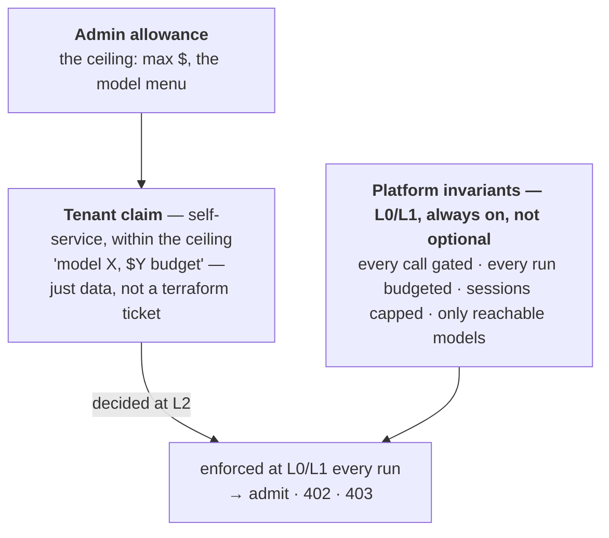

---

## 13 · Sandbox — and coding agents

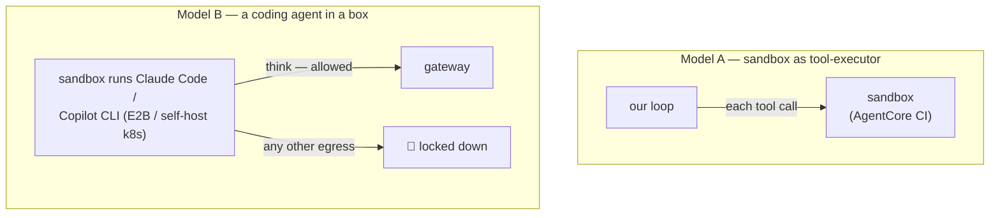

---

## 14 · Memory — the right store per tier

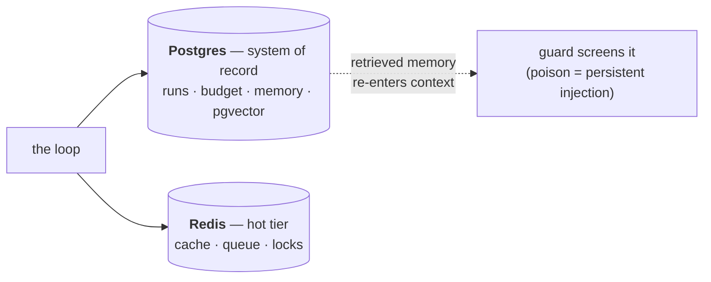

---

## 15 · Managed vs self-hosted — the cost curve

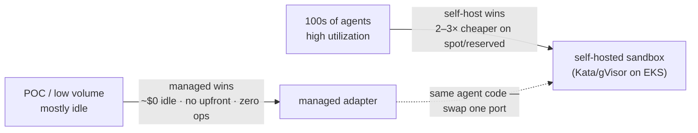

*Unit rates & worked example → [`costs.md`](costs.md). Managed ≈ 2× on-demand, 5–7× spot; break-even ~15% utilization on spot. The curve is now a deployment choice: two profiles, one contract ([ADR-0027](decisions/0027-two-deployment-profiles.md)) — full-mode store live as Aurora Serverless v2, pausing to $0 after 5 idle min.*

---

## 16 · Where it stands

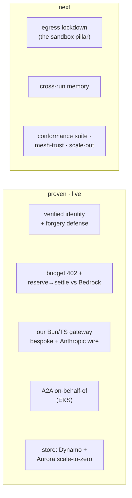
