# agent-os — diagrams only

> Diagram-per-idea, no speaker notes. For the narrated version see [`walkthrough.md`](walkthrough.md);
> for the prose reference see [`platform.md`](platform.md); for the cost model see [`costs.md`](costs.md).

---

## 1 · The premise

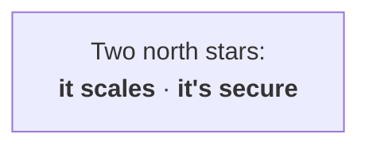

---

## 2 · Why agents are hard

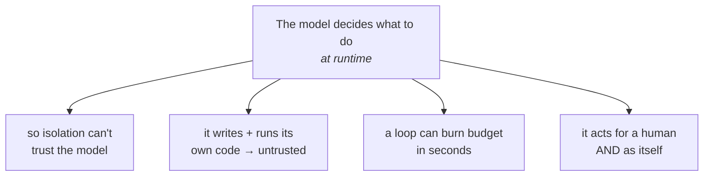

---

## 3 · The real question: buy, build, or both?

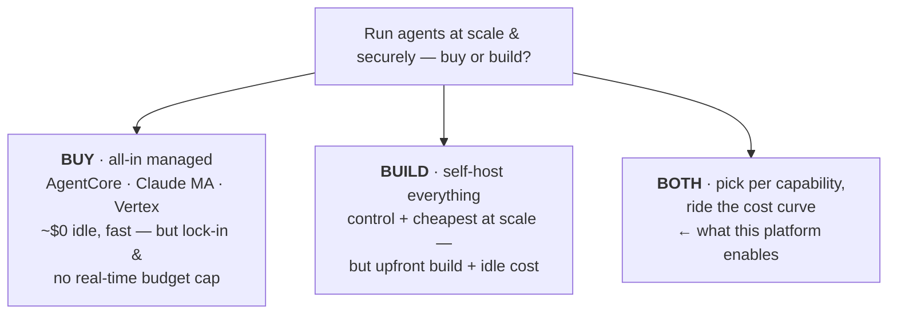

---

## 4 · The whole thing in three layers

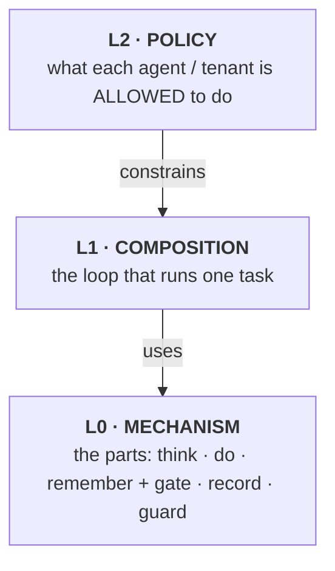

---

## 5 · L0 — the parts

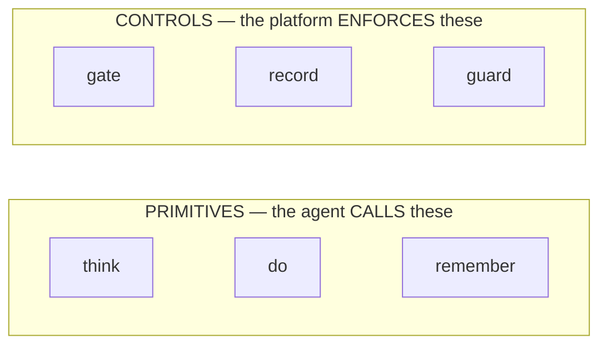

*Controls wrap primitives — e.g. the **gate** admits + meters each `think` (the 402); **guard** screens what crosses into it; **record** traces every step.*

---

## 6 · The three primitives

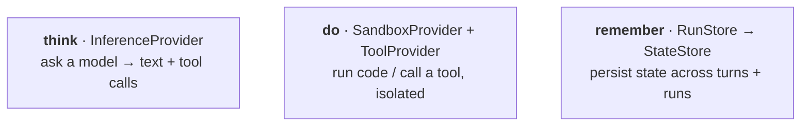

---

## 7 · The three controls

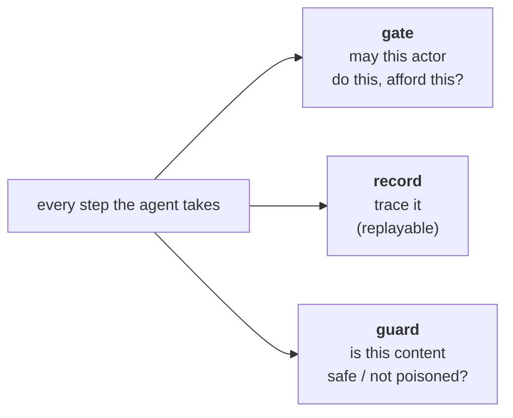

---

## 8 · Everything is swappable

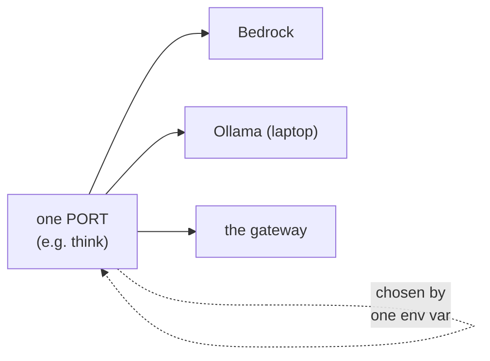

---

## 9 · L1 — the loop (this is "the agent")

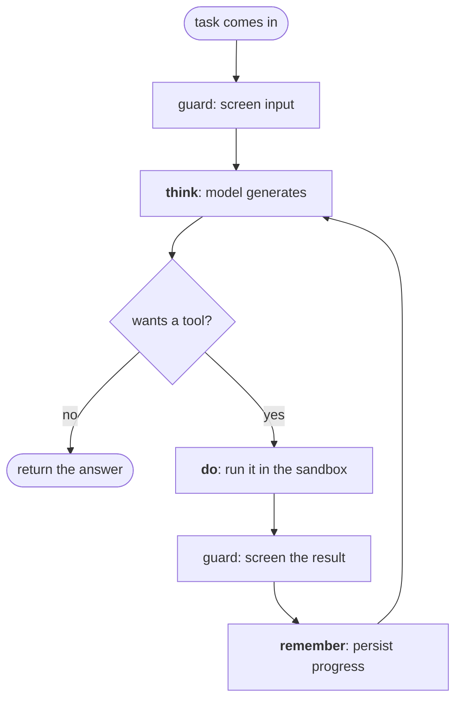

---

## 10 · The gate, opened up

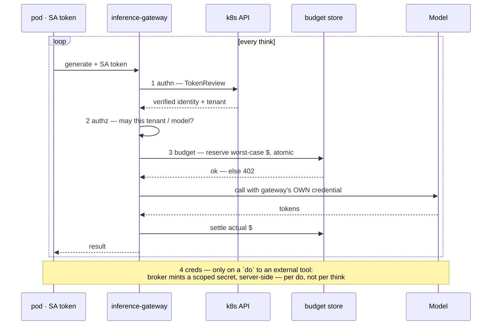

---

## 11 · A run, end to end

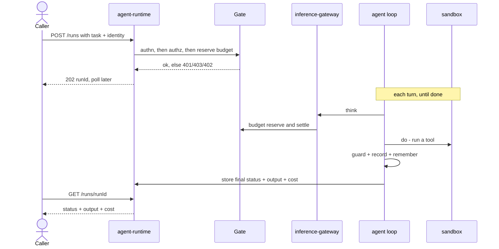

---

## 12 · L1 vs L2 — one engine, many agents

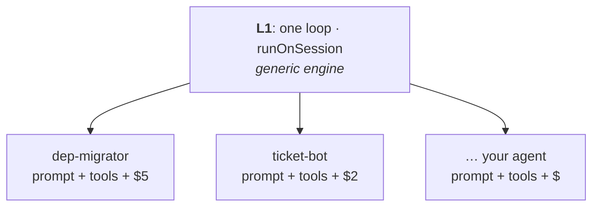

---

## 13 · L2 — policy sets the values; the platform enforces the limits

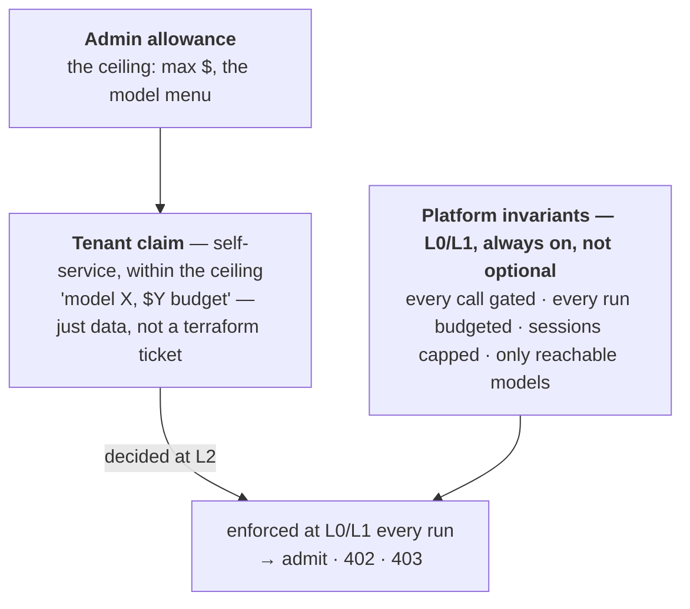

---

## 14 · Sandbox — and coding agents

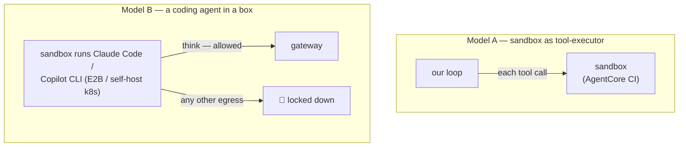

---

## 15 · Memory — the right store per tier

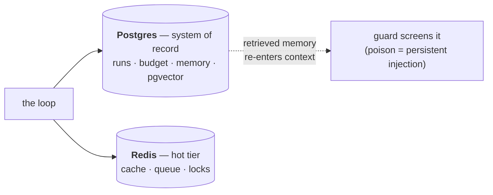

---

## 16 · Managed vs self-hosted — the cost curve

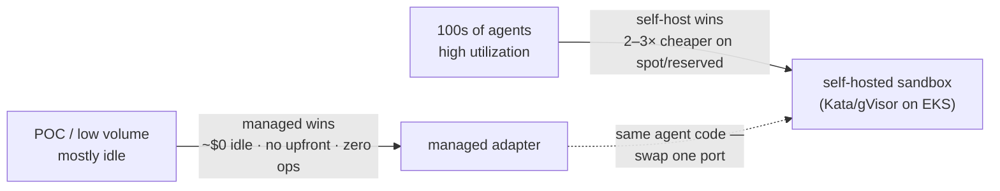

*Unit rates & worked example → [`costs.md`](costs.md). Managed ≈ 2× on-demand, 5–7× spot; break-even ~15% utilization on spot.*

---

## 17 · Where it stands

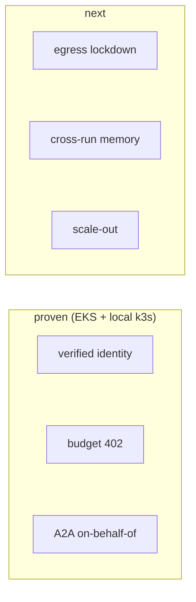
