# agent-os — a visual walkthrough

> Scroll top-to-bottom. Each section is one idea: a **diagram** and a **🎤 script** —
> what you'd say out loud presenting it. This is the *show-someone* version; the dense
> reference is [`platform.md`](platform.md), the canonical model is [`primitives.md`](primitives.md),
> and the money view is [`costs.md`](costs.md).

---

## 1 · The premise

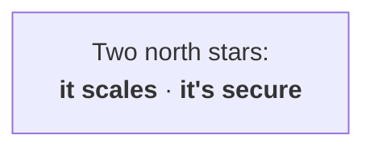

> 🎤 "This is my view of what a self-hosted, multi-tenant agent platform has to be. Everything
> in it serves two goals — it has to **scale** to many teams and agents, and it has to be
> **secure**, because we're running model-generated code on other people's behalf. Hold those
> two words; every design choice traces back to them."

---

## 2 · Why agents are hard

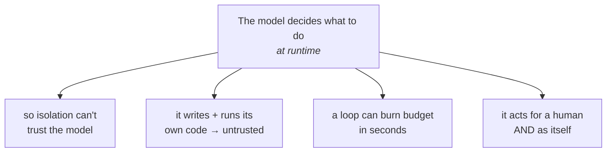

> 🎤 "Normal software is written by a person you can review. An agent decides what to do *while
> it's running* — so you can't pre-approve its actions. That one fact creates four problems:
> you can't trust it for isolation, the code it runs is hostile-by-default, a runaway loop spends
> real money fast, and every action carries two identities — the human who asked and the agent
> doing it. The platform exists to make those four problems survivable."

---

## 3 · The real question: buy, build, or both?

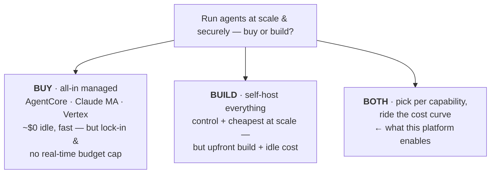

> 🎤 "Before any architecture, here's the question that actually drives the decision — and the bill.
> You're running agents at scale and securely: do you **buy** a managed platform — Bedrock AgentCore,
> Claude Managed Agents, Google's Vertex — or **build** it yourself? Buying is fast and costs nothing
> when idle, but you're locked in and, crucially, none of them gives you a real-time per-tenant budget
> hard-stop. Building gives you control and the cheapest unit cost at scale, but you pay upfront to
> build it and you pay for idle capacity. The real answer is **both** — choose per capability, and let
> cost decide where each lands: managed while you're small and idle, self-hosted once you're at scale
> and never idle. **This is the axis that matters most.** Everything else in this talk is how the
> platform keeps that choice open and adds the two things managed can't. We'll come back with the
> actual numbers at the end."

---

## 4 · The whole thing in three layers

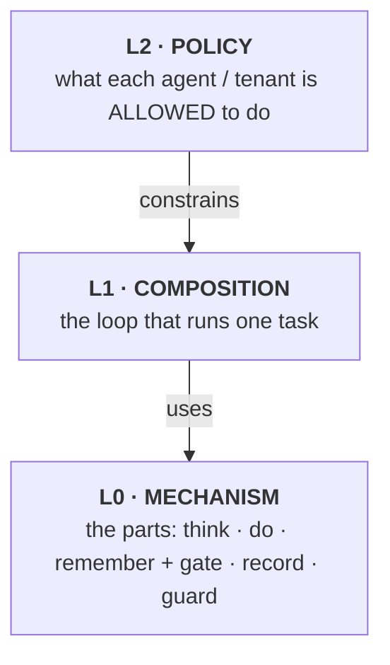

> 🎤 "The platform is three layers. At the bottom, **L0** — the raw parts: what an agent can *do*,
> and what the platform *enforces*. In the middle, **L1** — the loop that wires those parts into a
> running task. On top, **L2** — policy: what a given agent or tenant is actually allowed to do.
> The key idea: L0 is *what's possible*, L2 sets *what's permitted* — though some limits are
> baked-in invariants L0/L1 always enforce (we'll see that on the policy slide). They're
> deliberately separate layers: restricting an agent isn't a code change to the parts — it's a
> layer on top."

---

## 5 · L0 — the parts

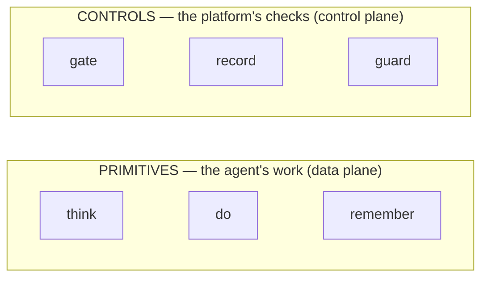

*Test — **delete it**: can't make progress = a **primitive** (the agent's work) · runs but ungoverned = a **control** (the platform's checks). Same split as k8s: pods vs RBAC + quota + admission.*

*Controls wrap primitives — the **gate** admits + meters each `think` (the 402); **guard** screens what crosses into it; **record** traces every step.*

> 🎤 "L0 is the parts, in two kinds — and here's the non-abstract way to tell them apart.
> **Primitives** are what the agent uses to get work done: *think*, *do*, *remember*. **Controls**
> are what the platform imposes around that work: *gate*, *record*, *guard*. The test is: **delete
> it — does the agent stop making progress, or just run ungoverned?** Take away *think* and there's
> no agent; take away the *gate* and the agent still works, it's just unmetered and unsafe. Progress
> → primitive; governance → control. If you know Kubernetes, it's the exact same split: primitives
> are the **pods doing the work**; controls are **RBAC, quotas, and admission webhooks** — they
> govern the work, they can say no, they run on everything, and they never do the workload's job."

---

## 6 · The three primitives

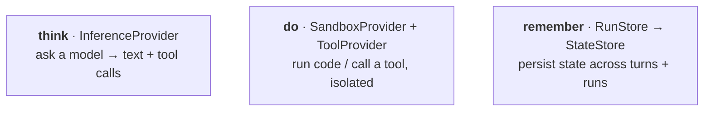

> 🎤 "Three primitives, each behind one port — one interface. *Think* is a model call. *Do* is
> execution: running model-written code in a sandbox, or calling a tool. *Remember* is durable
> state — first the run's own history, later long-term memory across runs. That's the entire
> vocabulary of what an agent can *do*. Notice tools aren't a fourth primitive — they're just the
> second face of *do*."

---

## 7 · The three controls

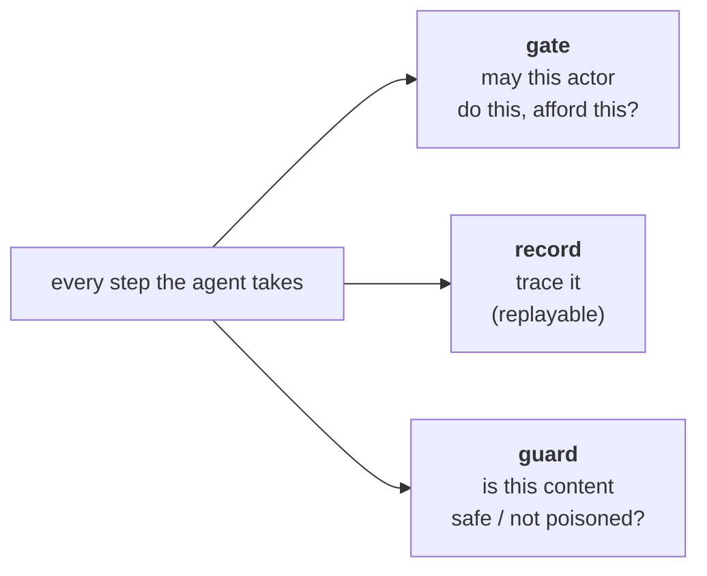

> 🎤 "Three controls wrap every step. *Gate* asks 'may this actor do this action, and can they
> afford it?' — identity and budget. *Record* traces every step so a non-deterministic agent run is
> replayable. *Guard* asks a different question — not *who*, but *is this content safe* — screening
> for prompt injection and bad output. Gate and guard are different axes: actor-authz versus
> content-safety. The agent never calls these; the platform applies them."

---

## 8 · Everything is swappable

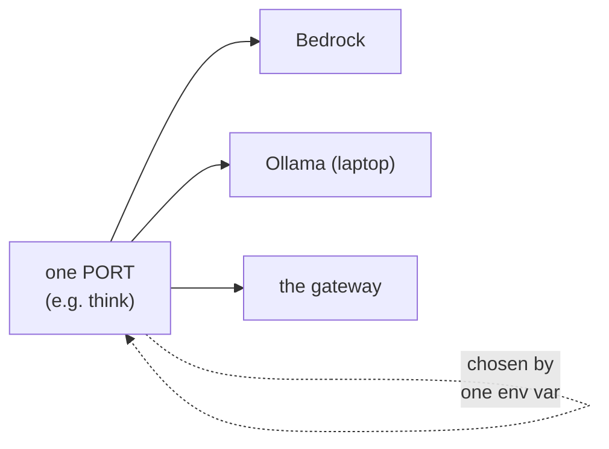

> 🎤 "Every primitive and control sits behind a port, and the implementation — the *adapter* — is
> picked by an environment variable. So *think* can be Bedrock in production, Ollama on my laptop,
> or routed through our gateway — same agent code, no rewrite. **This is the mechanism behind the
> buy-or-build answer**: because each capability is a port, you slide it between a managed service
> and a self-hosted one independently, and ride the cost curve without a rewrite. The defaults are
> AWS-native because it's the least-effort path, not because anything's locked in."

---

## 9 · L1 — the loop (this is "the agent")

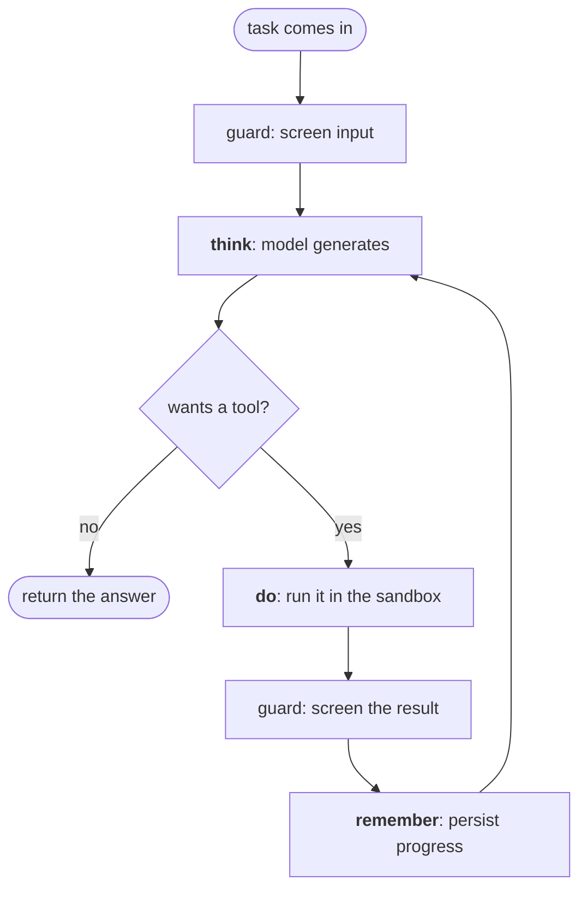

> 🎤 "This is the part people can't picture — and it's just a loop. The agent *is* this loop. A task
> comes in; we screen it; we ask the model; if the model wants a tool we run it in the sandbox,
> screen what comes back, save progress, and ask the model again — round and round until it says
> 'done.' That's it. Notice the loop holds **no** model, **no** sandbox, **no** database — it only
> *calls* them in the right order. L1 isn't an organ, it's the act of using the organs in sequence.
> It's the same boring loop every agent framework has — and that's the point: the boring loop is
> table stakes, the *governed* loop is the product."

---

## 10 · The gate, opened up

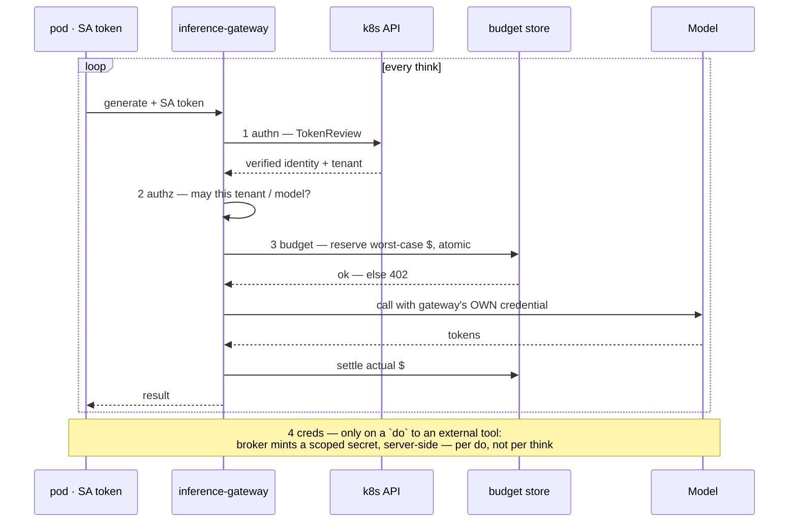

> 🎤 "Let's zoom into a single think. A pod — say `ticket-bot`, running as ServiceAccount
> `team-a/ticket-bot` — sends a generate call to the gateway with its SA token. Watch *who the
> gateway talks to*. It calls the **k8s API** to TokenReview that token — that's authn, verified not
> asserted — and gets back the identity plus the tenant, `team-a`. It checks **authz** — may team-a
> use this model? It calls the **budget store** to reserve the worst-case cost atomically — over
> budget, **402**, and the think never happens. Only then does it call the **model**, with *its own*
> credential — the pod has none — and settles the actual cost after. Everything inside that loop runs
> on **every** think, because the gateway is stateless. **Creds are the one exception** — the note at
> the bottom: they're minted per *do*, not per think, only when the agent calls an external tool like
> GitHub, applied server-side. And this whole picture is just *one* think — the next slide zooms out
> to the full run that repeats it."

---

## 11 · A run, end to end

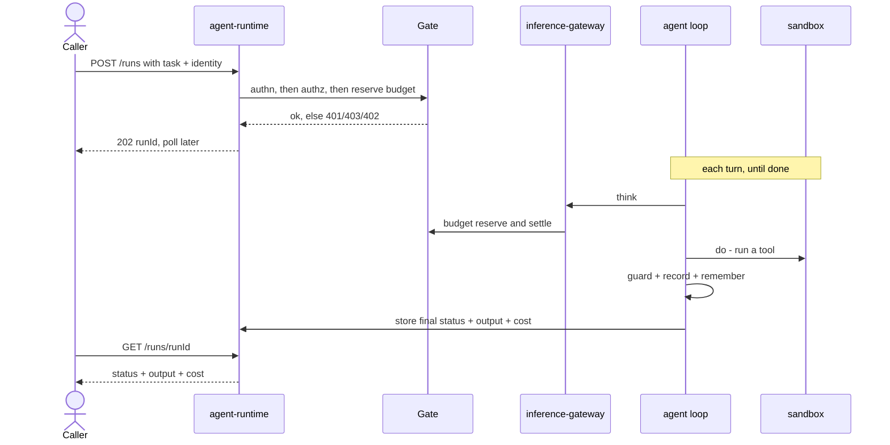

> 🎤 "Putting it together: a caller submits a task with their identity. The gate runs its four checks
> and we hand back a run ID immediately — runs are async. Then the loop turns on its own: every
> *think* goes through the gateway, which is the one place that holds model credentials and meters
> spend; every *do* runs in the sandbox; guard, record, remember fire on each step; and when it
> finishes, the runtime stores the final status, output, and cost. The caller comes back later with
> a GET on the run ID and gets the result — that's the async loop closing. Note the caller never
> holds a model key and never touches a primitive: they hand us a goal, poll for the answer, and we
> run the governed loop in between."

---

## 12 · L1 vs L2 — one engine, many agents

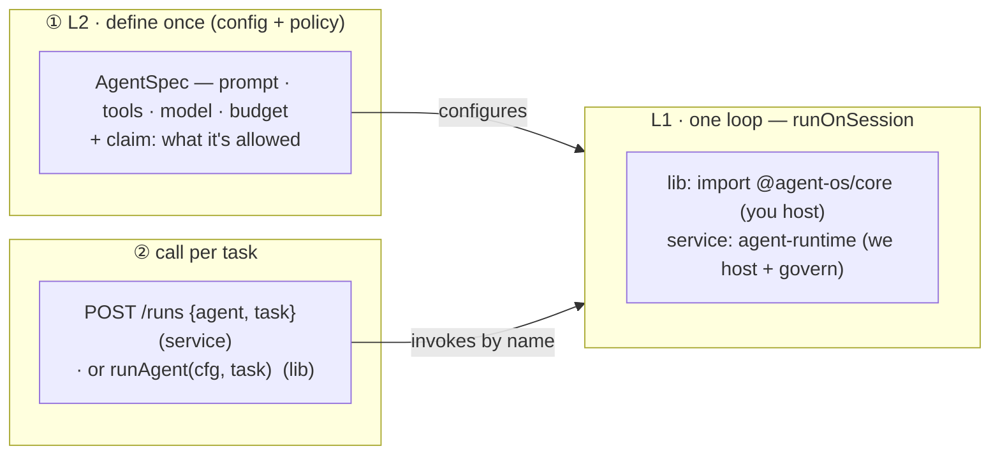

*L1 = one loop, shipped as a lib or a service. L2 = define the agent once (config + policy), then call it per task — define once, call many; the same loop serves every agent.*

> 🎤 "This is L1 and L2 made concrete. **L1 is one loop** — `runOnSession` — and it ships two ways:
> as a **library** you import and host yourself, or as the **agent-runtime service** we host and
> govern. Same loop either way. **L2 is your config**: you **define an agent once** — its prompt,
> tools, model, budget, and the claim for what it's allowed — register it, and then **call it per
> task**: `POST /runs` with the agent name and a task, and the runtime runs the loop with your
> config. *Define once, call many* — and the *same* loop serves every agent, dep-migrator and
> ticket-bot alike. A team works at L2 — define, then call; they never reach into L0, the loop
> mediates every primitive for them."

---

## 13 · L2 — policy sets the values; the platform enforces the limits

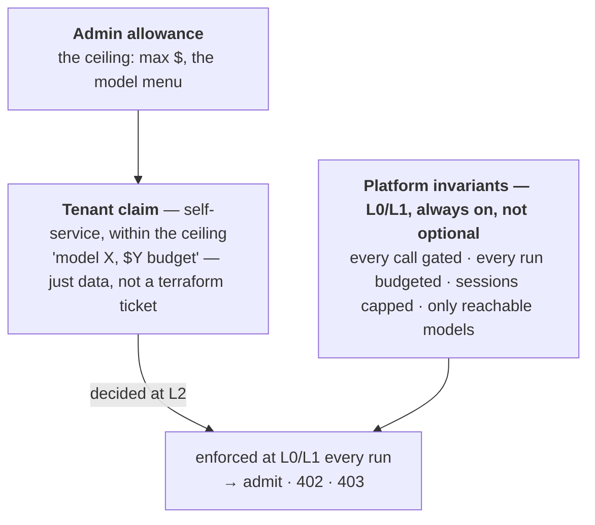

> 🎤 "Here's the bit people get backwards. The platform has **invariants** it *always* enforces —
> every model call is gated and metered, every run has a budget, sessions are capped, and you can
> only use models the platform can actually reach. Those aren't optional admin knobs; they're the
> platform's reason to exist, and they live in the controls (L0) and the loop (L1) — true for every
> tenant. What **L2** adds is the *values* inside those invariants: an admin sets the **ceiling** —
> the max budget and the menu of models on offer — and a tenant **self-services a claim** within it:
> 'give me model X with a $Y budget,' which is just data, not a terraform ticket. So the rule is:
> **the limit always exists (L0/L1 invariant); L2 only fills in its value (admin ceiling + tenant
> self-service); and it's enforced down in L0/L1 on every run.** Decided at the top, checked at the
> bottom — and onboarding becomes writing a policy record, not provisioning infrastructure."

---

## 14 · Sandbox — and coding agents

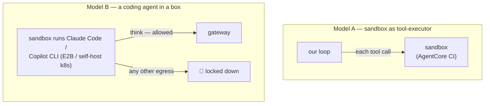

> 🎤 "Our first real use case is coding agents, and there are two ways to use a sandbox. **Model A**:
> our loop drives, and each individual tool call runs in the sandbox — great for snippets, AgentCore
> Code Interpreter is perfect. **Model B**: a whole foreign coding agent — Claude Code, Copilot CLI —
> runs *inside* the sandbox, and we just watch the boundary. For B you want custom images and long
> sessions, so E2B or self-hosting on our own k8s. The non-negotiable: the sandbox's *only* allowed
> network path is the gateway — everything else is locked down. Because once an agent can run code,
> the network lockdown does more for safety than any content filter can."

---

## 15 · Memory — the right store per tier

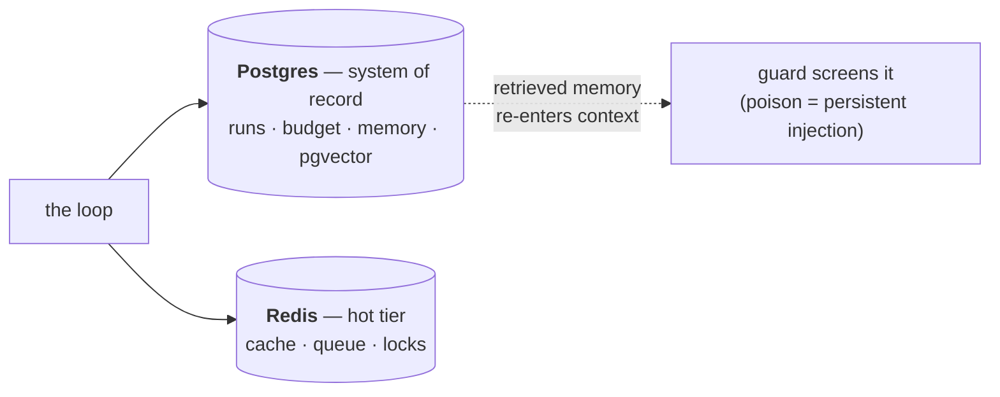

> 🎤 "Memory isn't one thing. **Postgres** is the durable system of record — run state, the budget
> ledger, long-term memory, and semantic search via pgvector, all in one store. **Redis** is the
> hot tier you reach for when you need a queue, a cache, or a lock. Lead with Postgres, add Redis
> when you actually need it. And one subtlety that ties back to guard: anything we *recall* from
> memory re-enters the model's context — so poisoned memory is a persistent injection, and guard has
> to screen what we remember, not just live tool output."

---

## 16 · Managed vs self-hosted — the cost curve

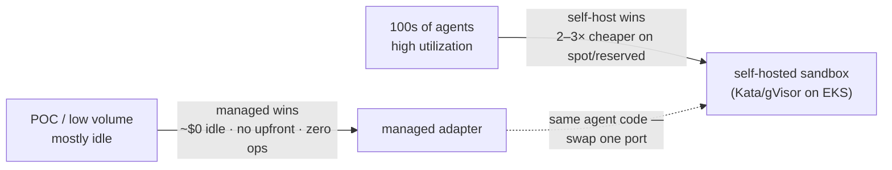

> 🎤 "Now the numbers — the payoff to the buy-or-build question from the start. The rule of thumb:
> **tokens are a wash** — you pay the model provider either way — so the real variable is runtime,
> sandbox compute, idle, and ops. Managed bills near zero when idle and has no upfront cost, so it
> wins at POC scale hands down. But managed compute is roughly **2× self-host on-demand and 5–7× on
> spot**, so at hundreds of agents — where you're never idle — that premium compounds into tens of
> thousands a month, and self-hosting on spot or reserved comes out **2–3× cheaper**. The break-even
> is low: above ~15% sustained utilization on spot, self-host already wins. So you **start managed
> and swap the sandbox port to self-hosted when volume crosses your ops cost** — the agent-os shell,
> the gateway and budget and identity, stays constant across that swap. The full model, the per-port
> vendor list, and the worked Python-to-Go example are in [`costs.md`](costs.md)."

---

## 17 · Where it stands

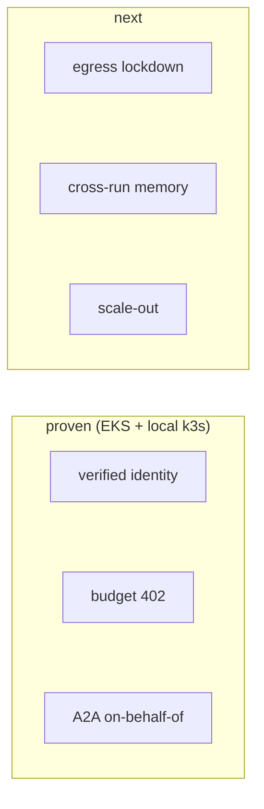

> 🎤 "And it's real, not a slide deck. Verified workload identity, the budget hard-stop returning
> 402, secrets kept out of the transcript, agent-to-agent calls with identity intact — all proven
> on real EKS and locally on k3s. What's next is the egress lockdown that makes coding-agent
> sandboxing airtight, cross-run memory, and then scale-out — deliberately last, because the
> interesting problems were isolation and cost, not throughput. That's the platform: a boring loop,
> made secure and multi-tenant, one governed step at a time."
